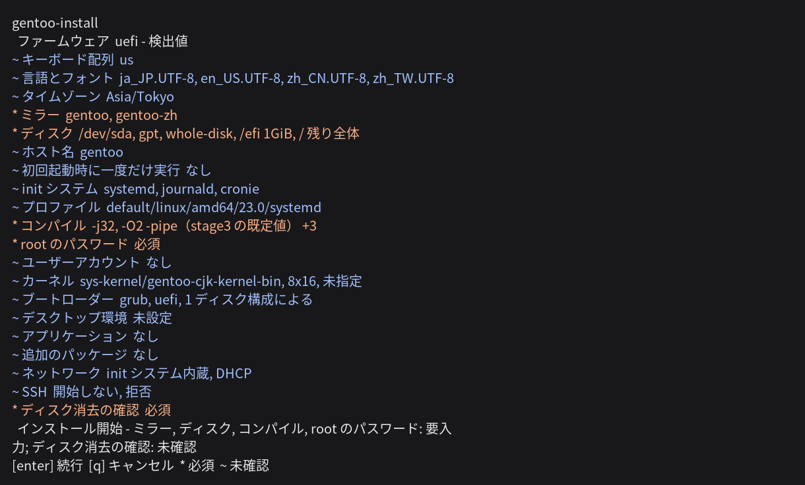

[English](README.md) | [正體中文](README.zh-TW.md) | [简体中文](README.zh-CN.md) | 日本語 | [한국어](README.ko.md)

# gentoo-install

<!-- fact: identity -->

gentoo-install は Linux ライブ環境で動作し、amd64 アーキテクチャの Gentoo システムをインストールするシステムインストーラです。インストール内容は、対話式メニューまたは TOML 設定ファイルで指定できます。プログラムのインターフェイスは、英語、繁体字中国語、簡体字中国語、日本語、韓国語に対応しています。




## 機能

<!-- fact: capability-scope -->

検証状況により狭い範囲が示されている場合を除き、以下の経路は実装済みであり、自動化された単体テストまたは plan テストで検査されています。

<!-- fact: storage-device-graph -->

**ストレージ** デバイスグラフは、GPT と MBR のパーティションテーブル、ext2、ext3、ext4、xfs、f2fs、vfat、subvolume を含む btrfs、swap、LUKS2 暗号化、LVM、mdraid を扱います。既存のパーティションテーブルを保持し、各パーティションに対して保持、フォーマット、削除のいずれかを個別に指定できます。

<!-- fact: zram-system -->

システム設定では、デバイスグラフおよび swap パーティションとは別に zram を設定できます。

<!-- fact: in-place-conversion -->

**インプレース変換。**`[disk]` テーブルで `mode = "in-place"` を設定すると、インストーラはディスクをパーティション分割する代わりに、稼働中のディストリビューションのユーザ空間を Gentoo で置き換えます。レイアウトはマシンから読み取るため、このテーブルはデバイス一覧を持ちません。`/bin`、`/sbin`、`/etc`、`/lib`、`/lib64`、`/usr`、`/var` が置き換えられ、`/home`、`/root`、`/srv`、`/opt` およびそれ以外のすべてのパスはそのまま残ります。`/etc` は統合ではなく置き換えです。

ステージングされたシステムは稼働中のシステムに触れずに `/gentoo-install.new` 以下で構築され、その後 `rename(2)` でディレクトリごとに交換されます。交換より後に実行されるのは、esp またはブートセクタへの書き込みだけです。ルートが LUKS、LVM、mdraid の下にある場合、ルートファイルシステムがこのインストーラで記述できない種類である場合、ルートファイルシステムの空き容量が 10 GiB 未満の場合、ライブメディア上で実行された場合は、いずれも何も書き込む前に理由を挙げて拒否されます。

<!-- fact: boot-system -->

**起動とシステム** インストーラでは、ブートローダーとして GRUB または systemd-boot を選択できます。GRUB は UEFI と BIOS に対応し、systemd-boot は UEFI に対応しています。また、systemd または OpenRC、dracut、locale、キーボードレイアウト、タイムゾーン、ホスト名、DNS、静的アドレス、選択したネットワークマネージャを設定できます。

<!-- fact: desktop-language -->

**デスクトップと言語対応** GNOME、KDE Plasma、Xfce を選択し、GDM、SDDM、LightDM のいずれかと組み合わせられます。グラフィックス設定は AMD、Intel、NVIDIA、仮想マシンに対応しています。パッケージカタログには Fcitx 5、Rime、Anthy、Mozc、Hangul、CJK フォントが含まれます。カーネルの選択肢には、cjktty パッチを含む `sys-kernel/gentoo-cjk-kernel-bin` と `sys-kernel/gentoo-cjk-kernel` があります。

<!-- fact: portage -->

**Portage** 設定項目には、profile、`MAKEOPTS`、`USE`、`ACCEPT_KEYWORDS`、`L10N`、ミラー、リポジトリ同期方式が含まれます。gentoo-zh と gig の overlay は個別に選択できます。インターフェイス言語として `zh-TW`、`zh-CN`、`ja`、`ko` のいずれかを選択すると、gentoo-zh のパッチ適用済みバイナリカーネルとその overlay も選択されます。`en` を選択した場合は自動的に選択されません。公式と gentoo-zh のバイナリパッケージ取得元は、それぞれ独立した設定と鍵を使用します。

<!-- fact: proxy -->

**セッションプロキシ** `[proxy]` テーブルは `kind`、`host`、`port`、任意の `username` と `password`、`bypass` を受け付けます。`kind` は `http`、`https`、`socks5` のいずれかです。`host` が空の場合は直接接続となり、これが既定値です。SOCKS5 は `socks5h://` を導出し、内部ホスト名をプロキシで解決します。メインメニューには値ごとのフィールドとプロキシ種類のメニューがあります。`bypass` はインターフェイスではコンマ区切りの値、TOML ではリストです。

プロキシを選択した後、設定したプロキシは stage3 と署名鍵、メインツリーおよび overlay のバージョン取得、`gitweb.gentoo.org` の ZFS ebuild 取得、`make.conf` と `FETCHCOMMAND`/`RESUMECOMMAND` を通る Portage のダウンロード、`wget`、`curl`、`git`、GnuPG、binhost、overlay、paste のアップロードに使用されます。時計、初期接続検査、メニュー前のミラー検査は設定を取得する前に実行されるため、この設定の対象外です。インストーラは dry-run の説明と公開設定から認証情報を除外します。公開設定とインストール済みシステムには、認証情報を含まないエンドポイントとバイパスリストだけが残ります。

<!-- fact: memory-environment -->

**メモリ環境。** `--ram` と `--lowram` はメモリ上に常駐するライブ環境への起動を一度だけ仕掛け、続いて再起動するかどうかを尋ねる。この経路に画面はない。対象となる計算機は SSH 接続が一本あるだけで、コンソールを持たないことが多いためである。`--ram` は Gentoo CJK ISO を用いる。ZFS を含み、約 2 GiB のメモリを要する。その initramfs は、メモリから 824 MiB のライブイメージを差し引いた値が 1 GiB を下回ると緊急シェルで停止する。`--lowram` は Alpine netboot 一式を用いる。より小さく、`zfs.ko` を持たない。いずれも版を固定しない。配布側が現在のイメージとチェックサムを公開しており、仕掛ける前に取得して検証する。

既定の起動項目は変更しない。したがって環境が立ち上がらなくても計算機は起動する。`--bypass` はこれを置き換える。一度きりの起動項目を破棄するファームウェア向けであり、環境が立ち上がらなければ計算機が全く起動しなくなる唯一の経路であるため、自動的に選択されることはない。

<!-- fact: memory-environment-access -->

**SSH によるメモリ導入の観察。** `--ssh-key` は公開鍵そのもの、パス、`http` または `https` の URL、および `github:user` と `gitlab:user` を受け付ける。`--ssh-port` と `--root-password` が残りを定める。導入器、選択された構成、鍵はいずれも initramfs の内部を通るため、環境はその構成を書いた版を実行し、最初のログインより前に `authorized_keys` が置かれている。操作者は SSH で再接続して導入の経過を見ればよく、コンソールを開いたままにする必要はない。最初の画面に答えるまで何も消去しない。その画面は導入と復旧シェルの二つを示し、時間切れを持たない。

<!-- fact: plan-records -->

**計画と記録** dry run はストレージハードウェアを調査せずに操作計画を表示します。実際のインストールでは、再利用するデバイスから調査した mdraid メタデータを追加したうえで同じ planner を使用するため、ハードウェアに依存する検証結果が変わる場合があります。`install.log` はコマンド出力を記録し、`install.jsonl` は操作、パッケージの取得元、バイナリパッケージのフォールバック理由を記録します。メニューは設定を `paste.gentoozh.org` にアップロードする前に、`password_hash` と `root_password_hash` の値を `removed-before-publishing` に置き換え、プロキシの `username` と `password` は鍵ごと出力しません。その他の設定値はアップロードに残ります。メニューはアップロード先ページのアドレスをテキストと QR コードで表示します。

## 検証状況

<!-- fact: verification-scope -->

[`TESTED.md`](TESTED.md) が検証記録です。実際に動かした経路ごとに 1 行あり、それが動作したインストーラのリビジョンと、動作した場所を記載します。実行が記録として数えられるのは、記録されたリビジョンがインストーラと一致し、インストールの終了コードが `0` で、導入されたシステムが起動し、起動後の設定チェックがすべて通った場合だけです。

ディスクへ導入する経路にはクラスタと単一マシンの記録があり、ext4、xfs、btrfs、f2fs、ZFS、LVM、mdraid、LUKS2 を、両方のファームウェアと両方の init システムで対象としています。動作中のシステムをインプレース変換する経路の記録は 2 件で、いずれも QEMU 上、いずれも BIOS です。メモリ環境への起動を仕掛ける経路は実装済みで、単体試験と計画試験が対象としています。ただし、いずれの実行も計算機をその環境へ再起動させておらず、記録はありません。イメージを書き込む経路は設計済みで、記録はありません。

`tests/fixtures/` 以下のファイルが対象とするのは設定モデルであり、その存在は導入されたマシンについて何も示しません。

## 要件

<!-- fact: requirements-runtime -->

実際のインストールには root 権限、amd64 アーキテクチャ、Python 3.11 以降が必要です。設定ファイルを使用する dry run には root 権限が必要ありません。インストーラには Python 標準ライブラリ以外の実行時依存関係がありません。

<!-- fact: requirements-version-sources -->

メニューは、Gentoo メインツリーのパッケージバージョンを `packages.gentoo.org` から、gentoo-zh のパッチ適用済みカーネルのバージョンを `api.github.com/repos/gentoo-zh/overlay/contents` から読み取ります。`sys-fs/zfs` が受け入れる最大カーネルバージョンは `gitweb.gentoo.org` から読み取ります。設定ファイルからのインストールでは、その設定が指定するミラーへの接続が必要です。`--missing-commands` と `--config FILE --dry-run` は、これらのバージョン取得先への接続を必要としません。

<!-- fact: requirements-network-filter -->

ライブ環境に IPv6 があり IPv4 がない場合、メニューは記録上 IPv4 専用の Gentoo ミラーを無効にします。

<!-- fact: requirements-bootstrap -->

`bootstrap.sh` は `/etc/os-release` を読み、不足しているコマンドを報告し、候補となるパッケージマネージャのコマンドを表示します。識別するディストリビューション系統は、Debian と Ubuntu、Arch、openSUSE、Fedora、RHEL と CentOS、Gentoo、Alpine です。表示されたコマンドは実行前に確認する必要があります。

## 安全上の注意

<!-- fact: safety-destructive -->

実際のインストールでは、選択したディスクに書き込みます。設定ファイルを使用して実行する場合、ディスク消去の確認は再度行われません。`wipe = true`、パーティションの削除、ファイルシステムの作成は既存データを破壊する可能性があります。

<!-- fact: safety-review-backup -->

実際のインストール前に、dry-run の出力でディスクセレクタとすべての破壊的操作を確認する必要があります。`/dev/sda` のような名前より、安定した `/dev/disk/by-id/` セレクタが望ましいです。保持する必要があるデータには、選択したディスクとは別のバックアップが必要です。

## インストール

<!-- fact: install-download -->

次のコマンドを使用すると、現在の `master` アーカイブをダウンロードしてメニューを開けます。

```sh
curl -fsSL https://github.com/Zakkaus/gentoo-install/archive/refs/heads/master.tar.gz | tar xz
cd gentoo-install-master
./bootstrap.sh
```

<!-- fact: install-terminal -->

メニューには、80 列 24 行以上の対話型端末が必要です。インストーラは起動時にインターフェイス言語の選択を一度求めます。`--lang ja` を使用すると、日本語を直接選択できます。

<!-- fact: install-config-workflow -->

メニューでは、設定を `my-install.toml` という設定ファイルに保存して終了できます。次の設定ファイルによる操作手順では、最初に完全な設定計画を表示し、その後に実際のインストールを実行します。

```sh
./bootstrap.sh --config my-install.toml --dry-run
# 続いて次のいずれか一方を実行します。どちらも選択したディスクに書き込みます。
./bootstrap.sh --config my-install.toml
./bootstrap.sh --config my-install.toml --no-shell   # 同じ実行で、root シェルの確認をしません
```

<!-- fact: install-root-shell -->

対話型インストールでは、成功時と失敗時のどちらでも、アンマウント前にターゲットシステム内で root シェルを開く選択肢が提示されます。`--no-shell` を使用すると、この確認を省略できます。

## 中断した実行の再開

<!-- fact: resume-behavior -->

`--resume` は、ジャーナル上の位置と識別子が現在の計画に一致し、再起動後も効果が残ると指定された完了済み操作だけを省略します。

```sh
./bootstrap.sh --config my-install.toml --resume
```

<!-- fact: resume-limits -->

再開は同じライブセッション、同じインストーラーリビジョン、同じ設定ファイルに限られます。既定のジャーナルは `/run/gentoo-install/install.jsonl` にあるため、再起動後には残りません。各操作記録には、その操作のクラスのソースとフィールド値から生成された識別子が含まれます。識別子が変わった操作は、省略されずに再度実行されます。共有のヘルパーや定数の変更はその識別子の範囲外であり、設定全体のダイジェストも記録されないため、異なるリビジョンや設定ファイルは文書化された再開範囲に含まれません。

## 設定ファイル

<!-- fact: config-model -->

設定ファイルは TOML 形式です。トップレベルの `config_version` フィールドがスキーマバージョンを指定します。ストレージはデバイスグラフで表します。各デバイスは `id` を持ち、ほかのデバイスを `id` で参照します。セレクタは実際のインストール時にのみ解決されます。

<!-- fact: config-fixtures -->

[`tests/fixtures/vm-binpkg.toml`](tests/fixtures/vm-binpkg.toml) は、UEFI と Ext4 を使用する完全なスキーマ参照です。ほかの [`tests/fixtures/`](tests/fixtures/) ファイルは BIOS、LUKS2、LVM、mdraid、ZFS、Btrfs subvolume、デスクトップを扱います。これらのファイルには仮想マシン用のディスクセレクタとテスト用パスワードが含まれているため、内容を変更せずに実機のインストールに使用してはなりません。

<!-- fact: config-dry-run -->

解析と計画ではストレージハードウェアを調査しないため、ターゲットディスクがないマシンでも `--dry-run` で設定を確認できます。

次の完全な設定は、認証情報と 2 つのバイパスホストを持つプロキシを示します。認証情報は例であり、実行前に置き換える必要があります。

```toml
config_version = 1

[proxy]
kind = "socks5"
host = "proxy.example"
port = 1080
username = "operator"
password = "secret"
bypass = ["localhost", "intranet.example"]

[system]
hostname = "proxy-target"
timezone = "UTC"
locales = ["en_US.UTF-8"]
locale = "en_US.UTF-8"
init = "openrc"
root_password_hash = "$6$gentooinst$IR3GrdJ862XljQYDqocr4tKniIRDIT.jQNFzIrHE3U75H6B6YSWZoSYoVd5edSHpqaYBdiNfXHCoIPRVgb9lT/"

[portage]
profile = "default/linux/amd64/23.0"
makeopts = "-j4"

[portage.binhost]
official = false

[bootloader]
firmware = "bios"

[disk]
root = "mnt-root"

[[disk.devices]]
kind = "existing"
id = "disk"
selector = "/dev/disk/by-id/virtio-target0"
wipe = true

[[disk.devices]]
kind = "table"
id = "table"
disk = "disk"
table = "mbr"

[[disk.devices]]
kind = "partition"
id = "rootpart"
table = "table"
index = 1
role = "data"

[[disk.devices]]
kind = "filesystem"
id = "rootfs"
device = "rootpart"
type = "ext4"

[[disk.devices]]
kind = "mountpoint"
id = "mnt-root"
source = "rootfs"
path = "/"
```

## バイナリパッケージ

<!-- fact: binary-packages -->

バイナリパッケージは任意の機能です。無効にしてもソースからビルドできます。公式 binhost と gentoo-zh binhost は別々の選択肢であり、それぞれ異なる信頼設定を使用します。binhost に接続できない場合、署名がない場合、鍵が信頼されていない場合を対象とする現在のエンドツーエンド根拠はなく、これらのフォールバック経路は未検証です。

## 終了コード

<!-- fact: exit-codes -->

`gentoo-install` では、`0` は正常終了、`1` は設定エラーを意味します。`2` は `argparse` の使用方法エラーまたは preflight の失敗、`3` は完全性検証の失敗を意味します。`4` はダウンロード、外部コマンド、OS、未分類のインストーラの失敗、`5` は操作者による中止を意味します。Python CLI の起動前に Python、必須コマンド、root 権限の検査が失敗した場合、`bootstrap.sh` も `1` で終了することがあります。

## よくある質問

<!-- fact: faq-customisation -->

**この種のインストーラーは Gentoo の自由な構成を損なうのか。**

損なわない。基礎的なインストールだけを行って終わる。パーティション、stage3、Portage の設定、カーネル、ブートローダー、および任意のデスクトップである。その後の判断はすべて運用者のものであり、できあがるのは本プロジェクトの構成要素が何も残らない通常の Gentoo である。取り除かれるのは最初の一時間の手間であり、それが Gentoo の導入と、多数の機材や VPS への展開を難しくしている。

## 開発への参加

<!-- fact: contributing -->

[CONTRIBUTING.md](CONTRIBUTING.md) では、開発環境、アーキテクチャ、必要な検査について説明しています。

## ライセンス

<!-- fact: license -->

本プロジェクトは GNU General Public License のバージョン 2、または受領者が選ぶそれ以降のバージョンのもとで配布される。バージョン 2 の全文は [LICENSE](LICENSE) にあり、各ソースファイルは `SPDX-License-Identifier: GPL-2.0-or-later` を持つ。
