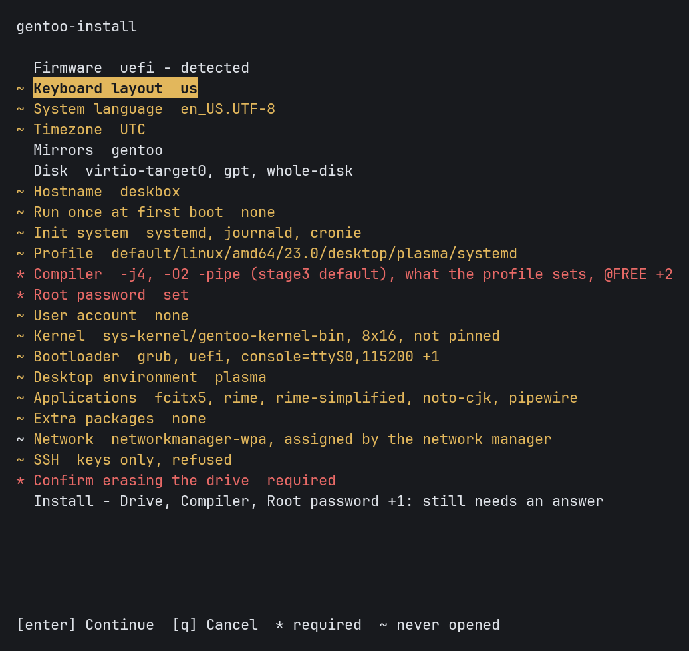

[English](README.md) | [正體中文](README.zh-TW.md) | [简体中文](README.zh-CN.md) | 日本語 | [한국어](README.ko.md)

# gentoo-install

gentoo-install は、互換性のある Linux ライブ環境上で amd64 アーキテクチャの Gentoo システムをインストールできるシステムインストーラです。インストール内容は、対話式メニューまたは TOML 設定ファイルで設定できます。プログラムのインターフェイスは、英語、繁体字中国語、簡体字中国語、日本語、韓国語に対応しています。




## 機能

**ストレージ** デバイスグラフは、GPT と MBR のパーティションテーブル、Ext2/3/4、XFS、F2FS、VFAT、および subvolume を含む Btrfs などのファイルシステム、swap、zram、LUKS2 暗号化、LVM、mdraid に対応しています。パーティション管理では、既存のパーティションテーブルを保持し、各パーティションに対して保持、フォーマット、削除のいずれかを個別に指定できます。

**起動とシステム** インストーラでは、ブートローダーとして GRUB または systemd-boot を選択できます。GRUB は UEFI と BIOS に対応し、systemd-boot は UEFI に対応しています。また、systemd または OpenRC、dracut、locale、キーボードレイアウト、タイムゾーン、ホスト名、DNS、静的アドレス、選択したネットワークマネージャを設定できます。

**デスクトップと言語対応** GNOME、KDE Plasma、Xfce を選択し、GDM、SDDM、LightDM のいずれかと組み合わせられます。グラフィックス設定は AMD、Intel、NVIDIA、仮想マシンに対応しています。パッケージカタログには Fcitx 5、Rime、Anthy、Mozc、Hangul、CJK フォントが含まれます。gentoo-zh が提供するパッチ適用済みカーネルは、Linux テキストコンソールに中国語、日本語、韓国語を表示できます。

**Portage** 設定項目には、profile、`MAKEOPTS`、`USE`、`ACCEPT_KEYWORDS`、`L10N`、ミラー、リポジトリ同期方式が含まれます。gentoo-zh と gig の overlay は明示的に有効にする必要があります。公式と gentoo-zh のバイナリパッケージ取得元は、それぞれ独立した設定と鍵を使用します。

**計画と記録** dry run と実際のインストールは同じ一連の操作を使用します。`install.log` はコマンド出力を記録し、`install.jsonl` は操作、パッケージの取得元、バイナリパッケージのフォールバック理由を記録します。メニューは機密情報を除去した設定を `paste.gentoozh.org` にアップロードし、アップロード先ページのアドレスをテキストと QR コードで表示できます。

## 検証状況

記録済みの最新エンドツーエンド検証ベースラインは、一部の UEFI と BIOS インストール、systemd、OpenRC、Ext4、Btrfs、XFS、LUKS2、LVM、mdraid、Plasma、公式 binhost を対象としています。有効な記録はそれぞれインストーラのリビジョンを明示し、インストール済みシステムが正常に起動した後に初めて検証の根拠として扱われます。

現在のリビジョンでは、ZFS と ZFSBootMenu、initramfs の SSH リモート解錠、greetd のデスクトップセッション、GNOME 以外での ibus は、このベースラインに含まれていません。既定以外の 6 種類のライブメディアからのインストールと、binhost 障害時のフォールバック経路もベースラインに含まれていません。`tests/fixtures/` のファイルは設定モデルのみを検証します。ファイルが存在していても、対応する組み合わせがエンドツーエンド検証に合格したことを意味しません。

## 要件

実際のインストールには root 権限、amd64 アーキテクチャ、Python 3.11 以降が必要です。設定ファイルを使用する dry run には root 権限が必要ありません。インストーラには Python 標準ライブラリ以外の実行時依存関係がありません。

メニューは各バージョンを `packages.gentoo.org` から読み取るため、このサイトへの接続が必要です。設定ファイルからのインストールでは、代わりにその設定が指定するミラーへの接続が必要になります。`--missing-commands` と `--config FILE --dry-run` はいずれも接続を必要としません。カーネルバージョンと `sys-fs/zfs` が対応する最大カーネルバージョンは実行時に読み取られます。

アドレスファミリはどちらか一方があれば十分です。経路が存在しないために失敗した要求は IPv4 で再試行されます。ミラー一覧は IPv4 のみで応答するサイトを記録しており、IPv4 アドレスを持たないマシンではメニューがそれらを選択できないようにします。

`bootstrap.sh` は `/etc/os-release` を読み、不足しているコマンドを報告し、候補となるパッケージマネージャのコマンドを表示します。Debian と Ubuntu、Arch、openSUSE、Fedora、RHEL と CentOS、Gentoo、Alpine など、複数のディストリビューション系統を識別できます。表示されたコマンドは実行前に確認する必要があります。

## 安全上の注意

実際のインストールでは、選択したディスクに書き込みます。設定ファイルを使用して実行する場合、ディスク消去の確認は再度行われません。`wipe = true`、パーティションの削除、ファイルシステムの作成は既存データを破壊する可能性があります。

実際のインストール前に、dry-run の出力でディスクセレクタとすべての破壊的操作を確認する必要があります。`/dev/sda` のような名前より、安定した `/dev/disk/by-id/` セレクタが望ましいです。誤操作によるデータ損失を防ぐため、保持する必要があるデータのバックアップは必須です。

## インストール

次のコマンドを使用すると、現在の `master` アーカイブをダウンロードしてメニューを開けます。

```sh
curl -fsSL https://github.com/Zakkaus/gentoo-install/archive/refs/heads/master.tar.gz | tar xz
cd gentoo-install-master
./bootstrap.sh
```

メニューには、80 列 24 行以上の対話型端末が必要です。インストーラは起動時にインターフェイス言語の選択を一度求めます。`--lang ja` を使用すると、日本語を直接選択できます。

メニューでは、設定を `my-install.toml` という設定ファイルに保存して終了できます。次の設定ファイルによる操作手順では、最初に完全な設定計画を表示し、その後に実際のインストールを実行します。

```sh
./bootstrap.sh --config my-install.toml --dry-run
./bootstrap.sh --config my-install.toml
./bootstrap.sh --config my-install.toml --no-shell   # root シェルを開くかどうかは確認しません
```

対話型インストールでは、成功時と失敗時のどちらでも、アンマウント前にターゲットシステム内で root シェルを開く選択肢が提示されます。`--no-shell` を使用すると、この確認を省略できます。

## 中断した実行の再開

`--resume` は、ジャーナルで完了済みと記録された操作を省略します。

```sh
./bootstrap.sh --config my-install.toml --resume
```

再開は同じライブセッションに限られます。既定のジャーナルは `/run/gentoo-install/install.jsonl` にあるため、再起動後には残りません。ジャーナルの各項目には、その操作の実装とその操作が持つフィールドのダイジェストが記録されるため、コードまたはフィールドが変更された操作は省略されずに再度実行されます。設定全体のダイジェストは記録されません。

## 設定ファイル

設定ファイルは TOML 形式です。トップレベルの `config_version` フィールドがスキーマバージョンを指定します。ストレージはデバイスグラフで表します。各デバイスは `id` を持ち、ほかのデバイスを `id` で参照します。セレクタは実際のインストール時にのみ解決されます。

[`tests/fixtures/vm-binpkg.toml`](tests/fixtures/vm-binpkg.toml) は、UEFI と Ext4 を使用する完全なスキーマ参照です。ほかの [`tests/fixtures/`](tests/fixtures/) ファイルは BIOS、LUKS2、LVM、mdraid、ZFS、Btrfs subvolume、デスクトップを扱います。これらのファイルには仮想マシン用のディスクセレクタとテスト用パスワードが含まれているため、内容を変更せずに実機のインストールに使用してはなりません。

解析と計画ではストレージハードウェアを調査しないため、ターゲットディスクがないマシンでも `--dry-run` で設定を確認できます。

## バイナリパッケージ

バイナリパッケージは任意の機能です。無効にしてもソースからビルドできます。公式 binhost と gentoo-zh binhost は別々の選択肢であり、それぞれ異なる信頼設定を使用します。現在のエンドツーエンド検証ベースラインは、binhost に接続できない場合、署名がない場合、鍵が信頼されていない場合を対象としていないため、これらのフォールバック経路は検証状況に引き続き記載されています。

## 終了コード

`0` は完了、`1` は設定エラー、`2` は preflight の失敗、`3` は完全性検証の失敗、`4` は外部コマンドの失敗、`5` は操作者による中止を意味します。

## 開発への参加

[CONTRIBUTING.md](CONTRIBUTING.md) では、開発環境、アーキテクチャ、必要な検査について説明しています。
