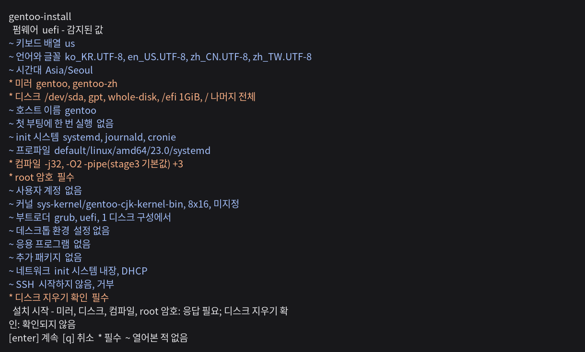
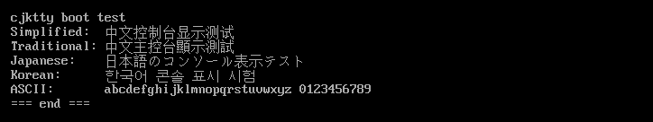

[English](README.md) | [正體中文](README.zh-TW.md) | [简体中文](README.zh-CN.md) | [日本語](README.ja.md) | 한국어

# gentoo-install

<!-- fact: identity -->

gentoo-install은 Linux 라이브 환경에서 실행되어 amd64 아키텍처의 Gentoo 시스템을 설치하는 시스템 설치 도구다. 설치 내용은 대화형 메뉴 또는 TOML 설정 파일로 지정할 수 있다. 프로그램 인터페이스는 영어, 번체 중국어, 간체 중국어, 일본어, 한국어를 제공한다.





## 기능

<!-- fact: capability-scope -->

검증 상태에서 더 좁은 범위를 밝힌 경우를 제외하면 아래 경로는 구현되어 있으며 자동화된 단위 테스트 또는 plan 테스트로 검사된다.

<!-- fact: storage-device-graph -->

**저장 장치** 장치 그래프는 GPT와 MBR 파티션 테이블, ext2, ext3, ext4, xfs, f2fs, vfat, subvolume을 포함하는 btrfs, swap, LUKS2 암호화, LVM, mdraid를 다룬다. ZFS도 같은 그래프에 속한다. 풀은 vdev 위에서 stripe, mirror, raidz1, raidz2, raidz3 중 하나를 취하고, 네이티브 암호화는 풀의 속성이며, 각 dataset은 그 자체로 하나의 노드다. 기존 파티션 테이블을 유지할 수 있으며 각 파티션에 유지, 포맷, 삭제 작업을 각각 지정할 수 있다.

<!-- fact: zram-system -->

시스템 설정은 장치 그래프와 swap 파티션과 별도로 zram을 구성할 수 있다.

<!-- fact: in-place-conversion -->

**인플레이스 변환.** `[disk]` 테이블에 `mode = "in-place"`를 설정하면 설치 도구는 디스크를 분할하는 대신 실행 중인 배포판의 사용자 공간을 Gentoo로 교체한다. 레이아웃은 기계에서 읽어 오므로 이 테이블은 장치 목록을 담지 않는다. `/bin`, `/sbin`, `/etc`, `/lib`, `/lib64`, `/usr`, `/var`가 교체되고 `/home`, `/root`, `/srv`, `/opt`를 비롯한 나머지 모든 경로는 그대로 남으며, `/etc`는 병합이 아니라 교체다.

스테이징된 시스템은 실행 중인 시스템을 건드리지 않은 채 `/gentoo-install.new` 아래에 구축되고, 그다음 `rename(2)`으로 디렉터리마다 교환된다. 교환 이후에 실행되는 것은 esp 또는 부트 섹터에 쓰는 작업뿐이다. 루트가 LUKS, LVM, mdraid 아래에 있는 경우, 루트 파일 시스템이 이 설치 도구가 기술할 수 없는 종류인 경우, 루트 파일 시스템의 여유 공간이 10 GiB 미만인 경우, 라이브 미디어에서 실행한 경우는 모두 아무것도 쓰기 전에 이유를 밝히고 거부한다.

<!-- fact: prepared-image -->

**디스크 이미지** `mode = "image"`는 디스크가 아니라 `disk.image`가 지정하고 `disk.size`가 크기를 정하는 희소 파일에 설치한다. 결과물은 다른 곳으로 복사해 두었다가 나중에 쓸 수 있는 파일이다. `mode = "dd"`는 설치를 수행하지 않는다. `disk.source`의 이미지를 `disk.destination` 디스크 전체로 스트리밍해 쓰고, 읽으면서 `raw`, `gz`, `xz`, `zst`, `tar`를 푼다. 그 이미지가 이미 담고 있는 레이아웃과 부트로더는 그대로 둔다. 두 모드는 서로의 키를 받지 않으며 `partition` 모드는 어느 쪽 키도 받지 않는다.

<!-- fact: boot-system -->

**부팅 및 시스템** 설치 도구에서는 GRUB, systemd-boot, ZFSBootMenu 부트로더를 선택할 수 있다. GRUB은 UEFI와 BIOS를 지원하고 systemd-boot는 UEFI를 지원한다. ZFSBootMenu는 UEFI에서 ZFS 루트를 부팅하며 커널은 풀 안 부트 환경 자체의 `/boot`에서 가져온다. 설치 도구는 systemd 또는 OpenRC, dracut, locale, 키보드 배열, 시간대, 호스트 이름, DNS, 고정 주소, 선택한 네트워크 관리자를 설정할 수도 있다.

<!-- fact: remote-unlock -->

**암호화된 루트를 ssh로 여는 경로** `[kernel.remote_unlock]`은 암호 구절 프롬프트 앞에 아무도 없는 기계를 위해 부팅 경로에 ssh 데몬을 놓는다. `enabled`가 이 경로를 켠다. `port`의 기본값은 22가 아니라 222이며, 실행 중인 시스템에 대한 클라이언트의 `known_hosts` 항목이 initramfs의 항목과 충돌하지 않게 한다. `address`, `gateway`, `interface`는 그 데몬에 고정 주소를 주고, 주소가 비어 있으면 DHCP를 쓴다. LUKS 루트는 시스템 initramfs 안의 `sys-kernel/dracut-crypt-ssh`가 열고, ZFS 루트는 ZFSBootMenu가 자기 이미지에 넣는 dropbear가 연다. 인가 키는 `system.authorized_keys`의 것이다. 이 경로를 켜고도 키를 하나도 적지 않은 설정은 이유를 밝히고 거부된다. 아무도 로그인할 수 없는 데몬을 기술하기 때문이다.

<!-- fact: desktop-language -->

**데스크톱 및 언어 지원** 설치 도구에서는 GNOME, KDE Plasma, Xfce를 선택하고 GDM, SDDM, LightDM, 또는 greetd와 그 tuigreet 콘솔 그리터 중 하나와 조합할 수 있다. 그래픽 설정은 AMD, Intel, NVIDIA, 가상 머신을 지원한다. 패키지 카탈로그에는 Fcitx 5, Rime, Anthy, Mozc, Hangul, CJK 글꼴이 포함된다. 커널 선택 항목에는 cjktty 패치가 적용된 `sys-kernel/gentoo-cjk-kernel-bin`과 `sys-kernel/gentoo-cjk-kernel`이 포함된다.

<!-- fact: portage -->

**Portage** 설정 항목에는 profile, `MAKEOPTS`, `USE`, `ACCEPT_KEYWORDS`, `L10N`, 미러, 저장소 동기화 방식이 포함된다. gentoo-zh와 gig overlay는 각각 선택할 수 있다. 인터페이스 언어로 `zh-TW`, `zh-CN`, `ja`, `ko` 중 하나를 선택하면 gentoo-zh의 패치된 바이너리 커널과 해당 overlay도 선택된다. `en`을 선택하면 자동으로 선택되지 않는다. 공식 바이너리 패키지 소스와 gentoo-zh 바이너리 패키지 소스는 각각 독립된 설정과 키를 사용한다.

<!-- fact: proxy -->

**세션 프록시** `[proxy]` 테이블은 `kind`, `host`, `port`, 선택 사항인 `username`과 `password`, `bypass`를 받는다. `kind`는 `http`, `https`, `socks5` 중 하나이며 `host`가 비어 있으면 직접 연결한다. SOCKS5는 `socks5h://`로 파생되므로 내부 호스트 이름을 프록시에서 확인한다. 주 메뉴에는 값마다 필드가 있고 프록시 종류는 메뉴에서 선택한다. `bypass`는 인터페이스에서 쉼표로 구분한 값이고 TOML에서는 목록이다.

프록시를 선택한 뒤 설정한 프록시는 stage3와 서명 키, 메인 트리 및 overlay 버전 조회, `gitweb.gentoo.org`의 ZFS ebuild 조회, `make.conf`와 `FETCHCOMMAND`/`RESUMECOMMAND`를 통한 Portage 다운로드, `wget`, `curl`, `git`, GnuPG, binhost, overlay, paste 업로드에 사용된다. 시계, 초기 연결 검사, 메뉴 전에 실행되는 미러 검사는 설정을 읽기 전에 실행되므로 이 설정의 대상이 아니다. 설치 도구는 dry-run 설명과 공개 설정에서 인증 정보를 제외한다. 공개 설정과 설치된 시스템에는 인증 정보가 없는 엔드포인트와 우회 목록만 남는다.

<!-- fact: memory-environment -->

**메모리 환경.** `--ram`과 `--lowram`은 메모리에 상주하는 라이브 환경으로 한 번만 부팅하도록 설정한 뒤 재부팅 여부를 묻는다. 이 경로에는 화면이 없다. 대상이 되는 컴퓨터는 SSH 연결 하나만 있고 콘솔이 없는 경우가 많기 때문이다. `--ram`은 Gentoo CJK ISO를 사용하며 ZFS를 포함하고 약 2 GiB의 메모리를 요구한다. 그 initramfs는 메모리에서 824 MiB의 라이브 이미지를 뺀 값이 1 GiB 아래로 내려가면 긴급 셸에서 멈춘다. `--lowram`은 Alpine netboot 묶음을 사용하며 더 작고 `zfs.ko`가 없다. 둘 다 판을 고정하지 않는다. 배포자가 현재 이미지와 검사합을 공개하므로 설정하기 전에 내려받아 검증한다.

기본 부팅 항목은 바꾸지 않으므로 환경이 올라오지 않아도 컴퓨터는 부팅한다. `--bypass`는 그것을 대체하며 한 번짜리 항목을 버리는 펌웨어를 위한 것이다. 환경이 올라오지 않으면 컴퓨터가 전혀 부팅하지 못하는 유일한 경로이므로 무엇도 이를 자동으로 선택하지 않는다.

<!-- fact: memory-environment-access -->

**SSH로 메모리 설치 관찰하기.** `--ssh-key`는 공개 키 본문, 경로, `http` 또는 `https` URL, 그리고 `github:user`와 `gitlab:user`를 받는다. `--ssh-port`와 `--root-password`가 나머지를 정한다. 설치기와 선택된 구성과 키는 모두 initramfs 안으로 들어가므로 환경은 그 구성을 작성한 판을 실행하며 첫 로그인 이전에 `authorized_keys`가 놓여 있다. 운영자는 SSH로 다시 접속해 설치 과정을 지켜보면 되고 콘솔을 열어 둘 필요가 없다. 첫 화면에 답하기 전에는 아무것도 지우지 않는다. 그 화면은 설치와 복구 셸 두 가지를 제시하며 시간 제한이 없다.

<!-- fact: plan-records -->

**계획 및 기록** dry run은 저장 장치 하드웨어를 조사하지 않고 작업 계획을 표시한다. 실제 설치는 재사용 장치에서 조사한 mdraid 메타데이터를 추가한 뒤 같은 planner를 사용하므로 하드웨어에 의존하는 검증 결과가 달라질 수 있다. `install.log`는 명령 출력을 기록하고, `install.jsonl`은 작업, 패키지 소스, 바이너리 패키지에서 소스 빌드로 전환한 사유를 기록한다. 메뉴는 설정을 `paste.gentoozh.org`에 업로드하기 전에 `password_hash`와 `root_password_hash` 값을 `removed-before-publishing`으로 바꾸고, 프록시의 `username`과 `password`는 키 자체를 출력하지 않는다. 다른 설정값은 업로드에 남는다. 메뉴는 업로드된 페이지의 주소를 텍스트와 QR 코드로 표시한다.

## 검증 상태

<!-- fact: verification-scope -->

[`TESTED.md`](TESTED.md)이 검증 기록이다. 실제로 수행한 경로마다 한 행이 있으며, 그것이 동작한 설치기 리비전과 동작한 장소를 적는다. 어떤 실행이 기록으로 인정되려면 기록된 리비전이 설치기와 일치하고, 설치 종료 코드가 `0`이며, 설치된 시스템이 부팅하고, 부팅 후 구성 점검이 모두 통과해야 한다.

디스크에 설치하는 경로에는 클러스터와 단일 기계의 기록이 있으며 ext4, xfs, btrfs, f2fs, ZFS, LVM, mdraid, LUKS2를 두 펌웨어와 두 init 시스템에서 다룬다. 실행 중인 시스템을 인플레이스로 변환하는 경로에는 QEMU 기록이 네 건 있다. 두 건은 BIOS이고, 한 건은 `/home`을 보존한 UEFI이며, 한 건은 루트가 btrfs이고 `/home`과 `/var`을 subvolume으로 유지한 UEFI 기록이다. 이 설치기가 만든 기계를 변환하는 경로에는 클러스터 기록도 있으며, 그 경로는 아직 신뢰할 수 없다. 재부팅까지 도달한 클러스터 변환 다섯 건 가운데 네 건은 부팅했고, 한 건은 모듈이 없어 GRUB 구조 셸에서 멈췄으나 변환 자체의 종료 코드는 `0`이었다.

`--ram`과 `--lowram`은 각각 QEMU 기록이 있다. Debian 12 기기가 한 번의 부팅을 설정하고, 기본 부팅 항목을 바꾸지 않은 채 재부팅하여 전달된 환경——`--ram`은 Gentoo CJK ISO, `--lowram`은 Alpine netboot 아카이브——으로 올라왔고, 전달받은 설정을 지니고 있었다. 그 화면에서 `install`을 답한 기록이 환경마다 하나씩 있다. 기기는 Gentoo를 설치했고, 기록한 디스크로 부팅했으며, 공용 설치 후 검사를 통과했다. 다른 기기에서는 설정된 항목의 initramfs를 지웠고, 하네스가 기기를 교체하며 수행하는 전원 재투입 뒤 이어진 두 번의 부팅 모두 원래 클라우드 시스템에 도달했다. `dd`는 기록이 하나 있다. live 매체에서 준비된 이미지를 디스크 전체에 쓰고 raw와 gzip 두 형식 모두 바이트 단위로 읽어 냈다.

고정 주소, ext2, ext3에는 각각 클러스터 기록이 있다. ZFS 기록은 stripe, mirror, raidz, 암호화된 풀, 그리고 ZFSBootMenu가 부팅한 풀을 포함한다. 원격 잠금 해제의 두 경로에도 각각 클러스터 기록이 있다. 시스템 initramfs가 연 LUKS 루트와 ZFSBootMenu 자체 이미지가 연 ZFS 풀이다. greetd에도 클러스터 기록이 있다.

파일에 설치하는 경로에는 기록이 하나 있다. 쓴 이미지를 `losetup -Pf`로 붙여 그 레이아웃이 선언한 두 파일 시스템으로 읽어 냈으나, 그 파일로 부팅한 기계는 아직 없다. 소스에서 빌드하는 커널과 binhost 폴백에는 runner 수준의 시험만 있으며, runner 수준의 시험은 엔드투엔드 기록이 아니다.

`tests/fixtures/` 아래의 파일이 다루는 것은 구성 모델이며, 그 존재는 설치된 기계에 대해 아무것도 입증하지 않는다.

## 요구 사항

<!-- fact: requirements-runtime -->

실제 설치에는 root 권한, amd64 아키텍처, Python 3.11 이상이 필요하다. 설정 파일로 dry run을 수행할 때는 root 권한이 필요하지 않다. 설치 도구에는 타사 Python 런타임 의존성이 없다.

<!-- fact: requirements-version-sources -->

메뉴는 Gentoo 메인 트리 패키지 버전을 `packages.gentoo.org`에서 읽고 gentoo-zh 패치 커널 버전을 `api.github.com/repos/gentoo-zh/overlay/contents`에서 읽는다. `sys-fs/zfs`가 허용하는 최대 커널 버전은 `gitweb.gentoo.org`에서 읽는다. 설정 파일로 설치할 때는 해당 설정이 지정한 미러에 연결해야 한다. `--missing-commands`와 `--config FILE --dry-run`은 이 버전 제공 지점에 연결하지 않는다.

<!-- fact: requirements-network-filter -->

라이브 환경에 IPv6가 있고 IPv4가 없으면 메뉴는 기록상 IPv4 전용인 Gentoo 미러를 비활성화한다.

<!-- fact: requirements-bootstrap -->

`bootstrap.sh`는 `/etc/os-release`를 읽고, 누락된 명령을 보고하며, 후보 패키지 관리자 명령을 표시한다. 인식하는 배포판 계열은 Debian과 Ubuntu, Arch, openSUSE, Fedora, RHEL과 CentOS, Gentoo, Alpine이다. 표시된 명령은 실행하기 전에 확인해야 한다.

## 안전

<!-- fact: safety-destructive -->

실제 설치는 선택한 디스크에 데이터를 기록한다. 설정 파일로 실행할 때는 디스크 삭제 여부를 다시 확인하지 않는다. `wipe = true`, 파티션 삭제, 파일 시스템 생성은 기존 데이터를 파괴할 수 있다.

<!-- fact: safety-review-backup -->

실제 설치 전에 dry-run 출력에서 디스크 선택자와 모든 파괴적 작업을 확인해야 한다. `/dev/sda` 같은 이름보다 안정적인 `/dev/disk/by-id/` 선택자가 더 적합하다. 보존해야 하는 데이터는 선택한 디스크와 분리된 위치에 별도 백업이 있어야 한다.

## 설치

<!-- fact: install-download -->

다음 명령을 사용하여 현재 `master` 아카이브를 다운로드하고 메뉴를 열 수 있다.

```sh
curl -fsSL https://github.com/Zakkaus/gentoo-install/archive/refs/heads/master.tar.gz | tar xz
cd gentoo-install-master
./bootstrap.sh
```

<!-- fact: install-terminal -->

메뉴에는 80열 24행 이상의 대화형 터미널이 필요하다. 설치 도구는 시작할 때 인터페이스 언어를 한 번 묻는다. `--lang ko`를 사용하면 한국어를 바로 선택할 수 있다.

<!-- fact: install-config-workflow -->

메뉴는 설정을 `my-install.toml`이라는 설정 파일로 저장한 뒤 종료할 수 있다. 다음 설정 파일 작업 절차에서는 전체 설정 계획을 먼저 표시한 다음 실제 설치를 수행한다.

```sh
./bootstrap.sh --config my-install.toml --dry-run
# 이어서 아래 두 줄 가운데 하나만 실행한다. 둘 다 선택한 디스크에 쓴다.
./bootstrap.sh --config my-install.toml
./bootstrap.sh --config my-install.toml --no-shell   # 같은 실행이며 root 셸을 묻지 않는다
```

<!-- fact: install-root-shell -->

대화형 설치에서는 성공하거나 실패한 경우 모두 마운트를 해제하기 전에 대상 시스템 안에서 root 셸을 여는 선택지를 제공한다. `--no-shell`을 사용하면 이 확인을 생략할 수 있다.

## 메모리에서 설치

<!-- fact: install-memory -->

`--ram`과 `--lowram`은 메모리에 올린 라이브 환경으로 한 번 부팅하도록 설정한다. 콘솔도 복구 이미지도 없는 임대 장비가 자기 디스크를 덮어쓰려면 이것이 필요하다. 설치 도구와 선택한 설정, 인가된 키는 initramfs 안에 실려 가므로 환경은 그것을 설정한 리비전으로 올라온다.

```sh
./bootstrap.sh --ram --ssh-key github:zakkaus --root-password 'replace this'
reboot
ssh root@the-machine
```

기본 부팅 항목은 바뀌지 않으므로 환경으로 올라오지 못한 장비는 이전과 같은 것을 부팅한다. `--disarm`은 설정을 되돌린다. `--bypass`는 기본 항목 자체를 대체하며, 일회성 항목을 버리는 펌웨어를 위한 것이다. 환경이 올라오지 못했을 때 장비가 아예 부팅하지 못하는 경로는 이것뿐이다.

첫 화면은 설치와 복구 셸을 제시하며 시간 제한이 없고, 답하기 전에는 아무것도 지우지 않는다. `--ram`은 ZFS를 담은 Gentoo CJK ISO를 부팅하며 약 2 GiB의 메모리가 필요하다. `--lowram`은 더 작고 `zfs.ko`가 없는 Alpine netboot 아카이브를 부팅한다. `--ssh-port`는 데몬을 22번에서 옮긴다.

## 실행 중인 시스템 변환

<!-- fact: install-in-place -->

`[disk]` 테이블의 `mode = "in-place"`는 디스크를 분할하는 대신 실행 중인 배포판의 사용자 공간을 교체한다. 레이아웃은 기계에서 읽어 오므로 이 테이블은 장치 목록을 담지 않는다.

```toml
config_version = 1

[system]
hostname = "converted"
timezone = "UTC"
locales = ["en_US.UTF-8"]
locale = "en_US.UTF-8"
init = "systemd"
root_password_hash = "$6$gentooinst$IR3GrdJ862XljQYDqocr4tKniIRDIT.jQNFzIrHE3U75H6B6YSWZoSYoVd5edSHpqaYBdiNfXHCoIPRVgb9lT/"

[portage]
profile = "default/linux/amd64/23.0/systemd"
makeopts = "-j4"

[bootloader]
kind = "grub"
firmware = "uefi"

[disk]
mode = "in-place"
```

위 해시는 예시이며 실행 전에 교체해야 한다. 대화형 실행은 변환이 교체하는 디렉터리를 출력하고 무언가를 쓰기 전에 `convert` 입력을 요구한다. 터미널이 없는 실행은 묻지 않는다. 설정 파일의 `mode = "in-place"`가 승인이며, 거기서 질문하면 시리얼 콘솔을 영원히 기다리게 하기 때문이다.

**이 실행을 시작한 세션이 생명줄이다.** `/usr`와 `/etc`가 새 시스템의 것이 되면 새 SSH 로그인은 성립하지 않으며, 실행을 시작한 세션만 이미 매핑한 바이너리를 유지한다. 

## 중단된 실행 재개

<!-- fact: resume-behavior -->

`--resume`은 저널의 위치와 식별자가 현재 계획과 일치하고 재부팅 후에도 효과가 유지된다고 표시된 완료 작업만 건너뛴다.

```sh
./bootstrap.sh --config my-install.toml --resume
```

<!-- fact: resume-limits -->

재개는 동일한 라이브 세션, 동일한 설치 프로그램, 동일한 설정 파일로 제한되며, 그 밖의 경우는 설치 프로그램이 거부한다. 저널의 첫 항목에는 설정의 다이제스트, 기계의 boot id, 설치 프로그램 소스의 다이제스트가 기록된다. `--resume`은 이 세 가지를 모두 비교하고, 하나라도 다르면 이유를 밝히고 중단한다. 커널이 boot id를 제공하지 않는 기계에서는 나머지 두 가지만 비교한다. 기본 저널은 `/run/gentoo-install/install.jsonl`에 있으므로 어느 경우에도 재부팅 후에는 남아 있지 않는다. 각 작업 기록에는 해당 작업 클래스의 소스와 필드 값에서 만든 식별자도 포함된다. 식별자가 바뀐 작업은 건너뛰지 않고 다시 수행되며, 공용 헬퍼나 상수의 변경은 그 식별자의 범위 밖이지만 설치 프로그램 다이제스트가 이를 포괄한다.

## 설정 파일

<!-- fact: config-model -->

설정 파일은 TOML 형식이다. 최상위 `config_version` 필드가 스키마 버전을 지정한다. 저장 장치는 장치 그래프로 표현된다. 각 장치에는 `id`가 있으며, 장치는 다른 장치를 `id`로 참조한다. 선택자는 실제 설치 중에만 해석된다.

<!-- fact: config-fixtures -->

[`tests/fixtures/vm-binpkg.toml`](tests/fixtures/vm-binpkg.toml)은 UEFI와 Ext4 구성을 모두 포함한 완전한 스키마 참조 파일이다. [`tests/fixtures/`](tests/fixtures/)의 다른 파일은 BIOS, LUKS2, LVM, mdraid, ZFS, Btrfs subvolume, 데스크톱을 다룬다. 이 설정 파일들에는 가상 머신 디스크 선택자와 테스트용 암호가 포함되어 있으므로, 내용을 수정하지 않은 채 실제 머신 설치에 사용해서는 안 된다.

<!-- fact: config-dry-run -->

구문 분석과 계획 단계에서는 저장 장치 하드웨어를 조사하지 않으므로 대상 디스크가 없는 머신에서도 `--dry-run`으로 설정을 확인할 수 있다.

다음 완전한 설정은 인증 정보와 우회 호스트 두 개가 있는 프록시를 보여 준다. 인증 정보는 예시이므로 실행하기 전에 바꿔야 한다.

```toml
config_version = 1

[proxy]
kind = "socks5"
host = "proxy.example"
port = 1080
username = "operator"
password = "secret"
bypass = ["localhost", "intranet.example"]

[system]
hostname = "proxy-target"
timezone = "UTC"
locales = ["en_US.UTF-8"]
locale = "en_US.UTF-8"
init = "openrc"
root_password_hash = "$6$gentooinst$IR3GrdJ862XljQYDqocr4tKniIRDIT.jQNFzIrHE3U75H6B6YSWZoSYoVd5edSHpqaYBdiNfXHCoIPRVgb9lT/"

[portage]
profile = "default/linux/amd64/23.0"
makeopts = "-j4"

[portage.binhost]
official = false

[bootloader]
firmware = "bios"

[disk]
root = "mnt-root"

[[disk.devices]]
kind = "existing"
id = "disk"
selector = "/dev/disk/by-id/virtio-target0"
wipe = true

[[disk.devices]]
kind = "table"
id = "table"
disk = "disk"
table = "mbr"

[[disk.devices]]
kind = "partition"
id = "rootpart"
table = "table"
index = 1
role = "data"

[[disk.devices]]
kind = "filesystem"
id = "rootfs"
device = "rootpart"
type = "ext4"

[[disk.devices]]
kind = "mountpoint"
id = "mnt-root"
source = "rootfs"
path = "/"
```

## 바이너리 패키지

<!-- fact: binary-packages -->

바이너리 패키지는 선택 사항이다. 비활성화해도 소스에서 빌드할 수 있다. 공식 binhost와 gentoo-zh binhost는 별도의 선택 사항이며 각각 독립된 신뢰 설정을 사용한다. binhost에 연결할 수 없거나 서명이 없거나 키를 신뢰할 수 없는 경우를 다루는 현재 엔드투엔드 증거는 없으며, 이 전환 경로는 검증되지 않았다.

## 종료 코드

<!-- fact: exit-codes -->

`gentoo-install`에서 `0`은 정상 완료, `1`은 설정 오류를 의미한다. `2`는 `argparse` 사용법 오류 또는 preflight 실패, `3`은 무결성 검증 실패를 의미한다. `4`는 다운로드, 외부 명령, OS 또는 분류되지 않은 설치 도구 실패, `5`는 운영자 중단을 의미한다. Python CLI가 시작되기 전에 Python, 필수 명령 또는 root 권한 검사가 실패하면 `bootstrap.sh`도 `1`로 종료될 수 있다.

## 자주 묻는 질문

<!-- fact: faq-customisation -->

**이런 설치 프로그램이 Gentoo의 자유로운 구성을 해치는가?**

해치지 않는다. 기본 설치만 수행하고 끝난다. 파티션, stage3, Portage 설정, 커널, 부트로더, 그리고 선택적인 데스크톱이다. 그 이후의 모든 결정은 운영자의 것이며, 완성된 기계는 이 프로젝트의 구성 요소가 하나도 남지 않은 평범한 Gentoo이다. 없어지는 것은 첫 한 시간의 비용이고, 그것이 Gentoo를 시작하기 어렵게 하고 많은 기계나 VPS에 배포하기 어렵게 만든다.

## 기여

<!-- fact: contributing -->

개발 환경, 아키텍처, 필수 검사는 [CONTRIBUTING.md](CONTRIBUTING.md)에 설명되어 있다.

## 라이선스

<!-- fact: license -->

이 프로젝트는 GNU General Public License 버전 2 또는 수령자가 선택하는 이후 버전에 따라 배포된다. 버전 2 전문은 [LICENSE](LICENSE)에 있으며, 각 소스 파일은 `SPDX-License-Identifier: GPL-2.0-or-later`를 가진다.
