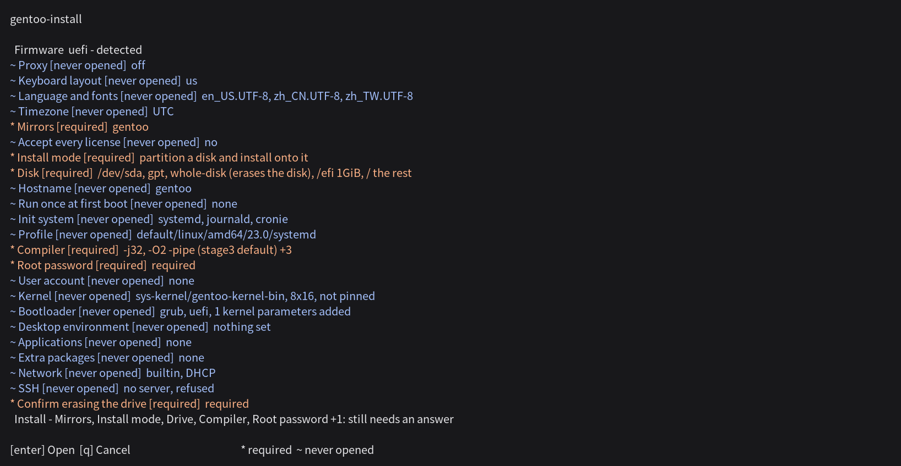

English | [正體中文](README.zh-TW.md) | [简体中文](README.zh-CN.md) | [日本語](README.ja.md) | [한국어](README.ko.md)

# gentoo-install

<!-- fact: identity -->

gentoo-install runs in a Linux live environment to install an amd64 Gentoo system. An interactive menu or a TOML configuration file specifies the installation. The interface is available in English, Traditional Chinese, Simplified Chinese, Japanese and Korean.




## Capabilities

<!-- fact: capability-scope -->

The paths below are implemented and have automated unit or plan coverage unless the verification status identifies a narrower boundary.

<!-- fact: storage-device-graph -->

**Storage.** The device graph covers GPT and MBR; ext2, ext3, ext4, btrfs subvolumes, xfs, f2fs and vfat; swap; and LUKS2, LVM and mdraid. Existing partition tables can be retained, with a separate keep, format or delete decision for each partition.

<!-- fact: zram-system -->

The system configuration can configure zram independently of the device graph and swap partitions.

<!-- fact: in-place-conversion -->

**In-place conversion.** Setting `mode = "in-place"` in the `[disk]` table replaces the userland of the running distribution with Gentoo instead of partitioning a disk. The layout is read from the machine, so the table carries no device list. `/bin`, `/sbin`, `/etc`, `/lib`, `/lib64`, `/usr` and `/var` are replaced; `/home`, `/root`, `/srv`, `/opt` and every other path are left alone, and `/etc` is replaced rather than merged.

The staged system is built under `/gentoo-install.new` while the running one is untouched, each directory is then exchanged with `rename(2)`, and only the writes to the esp or the boot sector follow the exchange. A root below LUKS, LVM or mdraid, a root filesystem this installer cannot describe, a machine with less than 10 GiB free on the root filesystem, and a live medium are each refused by name before anything is written.

<!-- fact: boot-system -->

**Boot and system.** GRUB supports UEFI and BIOS, and systemd-boot supports UEFI. The installer configures systemd or OpenRC, dracut, locale, keyboard layout, timezone, hostname, DNS, static addresses and the selected network manager.

<!-- fact: desktop-language -->

**Desktop and language support.** GNOME, KDE Plasma and Xfce are available with gdm, sddm or lightdm. Graphics settings cover AMD, Intel, NVIDIA and virtual machines. The package catalog includes fcitx5, Rime, Anthy, Mozc, Hangul and CJK fonts. The kernel choices include `sys-kernel/gentoo-cjk-kernel-bin` and `sys-kernel/gentoo-cjk-kernel`, both of which carry the cjktty patch.

<!-- fact: portage -->

**Portage.** The configuration covers the profile, `MAKEOPTS`, `USE`, `ACCEPT_KEYWORDS`, `L10N`, mirrors and repository synchronization. The gentoo-zh and gig overlays can be selected independently. Selecting `zh-TW`, `zh-CN`, `ja` or `ko` as the interface language also selects the gentoo-zh patched binary kernel and its overlay; selecting `en` does not. Official and gentoo-zh binary package sources have separate settings and keys.

<!-- fact: proxy -->

**Session proxy.** The `[proxy]` table accepts `kind`, `host`, `port`, optional `username` and `password`, and `bypass`. `kind` is `http`, `https` or `socks5`; an empty host selects direct connection, which is the default. SOCKS5 derives `socks5h://`, so host names resolve at the proxy for intranet access. The interface has one field per value and a menu for the proxy kind. The bypass value is comma-separated in the interface and a list in TOML.

After the proxy is selected, the configured proxy is used for stage3 and its signing key, main-tree and overlay version lookups, the `gitweb.gentoo.org` ZFS ebuild lookup, Portage downloads through `make.conf` and `FETCHCOMMAND`/`RESUMECOMMAND`, `wget`, `curl`, `git`, GnuPG, the binhost, overlays and paste upload. The clock, initial connectivity check and pre-menu mirror check run before the configuration is available and therefore are not covered by this setting. The installer keeps the credential out of dry-run descriptions and publishes a credential-free proxy endpoint with the bypass list; the installed system receives that endpoint and list.

<!-- fact: memory-environment -->

**Memory environment.** `--ram` and `--lowram` arm one boot into a live environment held in memory, then ask whether to reboot; there is no interface on this path, because the machine it addresses usually has one SSH session and no console. `--ram` uses the Gentoo CJK ISO, which carries ZFS and needs about 2 GiB of RAM, because its initramfs stops at an emergency shell when memory less the 824 MiB live image falls under 1 GiB. `--lowram` uses the Alpine netboot bundle, which is smaller and has no `zfs.ko`. Neither pins a version: both publishers list the current image with its checksum, which is fetched and verified before anything is armed.

The default boot entry is never changed, so an environment that does not come up leaves a machine that still boots. `--bypass` replaces it instead, for firmware that drops a one-shot entry; it is the one path where an environment that does not come up leaves a machine that does not boot at all, and nothing selects it automatically.

<!-- fact: memory-environment-access -->

**Watching a memory install over SSH.** `--ssh-key` accepts a literal public key, a path, an `http` or `https` URL, or `github:user` and `gitlab:user`; `--ssh-port` and `--root-password` set the rest. The installer, the chosen configuration and the keys travel inside the initramfs, so the environment runs the revision that wrote that configuration and reaches `authorized_keys` before the first login. The operator reconnects over SSH and watches the install rather than holding a console open. Nothing is erased until the first screen is answered: it offers the install and a rescue shell, and has no timeout.

<!-- fact: plan-records -->

**Plan and records.** A dry run prints an operation plan without probing storage hardware. A real installation uses the same planner after adding probed mdraid metadata for reused devices, so hardware-dependent validation can change the result. `install.log` records command output, and `install.jsonl` records operations, package sources and binary-package degradation reasons. Before uploading a configuration to `paste.gentoozh.org`, the menu replaces `password_hash` and `root_password_hash` with `removed-before-publishing` and omits the proxy `username` and `password` keys entirely; the other configuration values remain in the upload. The menu displays the resulting page address as text and as a QR code.

## Verification status

<!-- fact: verification-scope -->

[`TESTED.md`](TESTED.md) is the verification record: one row for each exercised path, naming the installer revision it ran at and where it ran. A run counts only when its recorded revision matches the installer, its installation exit code is `0`, the installed system boots, and the post-boot configuration checks pass.

Installing onto a disk has cluster and single-machine records across ext4, xfs, btrfs, f2fs, ZFS, LVM, mdraid and LUKS2, on both firmwares and both init systems. Converting a running system in place has three QEMU records: two BIOS records and one UEFI record that booted through its own firmware entry and retained `/home`.

`--ram` and `--lowram` each have QEMU records. A Debian 12 machine armed one boot, kept its default entry, rebooted and came up in the delivered environment — the Gentoo CJK ISO for `--ram`, the Alpine netboot archive for `--lowram` — carrying the configuration it was given. Answering `install` there has one record: the machine installed Gentoo, booted the disk it had written and passed the shared installed-state checks. A second machine had its armed entry's initramfs removed and reached its own cloud system on the two boots that followed, after the power cycle the harness performs between guests. `dd` has one record: a prepared image written onto a whole disk from a live medium and read back byte for byte, raw and gzipped.

The runner fixture list includes static addressing, ext2, ext3 and a source-built kernel. A runner-level test covers binhost degradation. These tests and fixtures are not end-to-end records.

Files under `tests/fixtures/` exercise the configuration model; their presence establishes nothing about an installed machine.

## Requirements

<!-- fact: requirements-runtime -->

A real installation requires root privileges, an amd64 target and Python 3.11 or newer. A configuration-file dry run does not require root privileges. The installer has no third-party Python runtime dependency.

<!-- fact: requirements-version-sources -->

The menu reads Gentoo main-tree package versions from `packages.gentoo.org` and gentoo-zh patched-kernel versions from `api.github.com/repos/gentoo-zh/overlay/contents`. It reads the maximum kernel version accepted by `sys-fs/zfs` from `gitweb.gentoo.org`. An installation from a configuration file requires the mirror that configuration names instead; `--missing-commands` and `--config FILE --dry-run` require none of these version endpoints.

<!-- fact: requirements-network-filter -->

The menu disables recorded IPv4-only Gentoo mirrors when the live environment has IPv6 but no IPv4.

<!-- fact: requirements-bootstrap -->

`bootstrap.sh` reads `/etc/os-release`, reports missing commands and prints a candidate package-manager command. It recognizes these distribution families: Debian and Ubuntu; Arch; openSUSE; Fedora, RHEL and CentOS; Gentoo; and Alpine. The printed command must be reviewed before it is run.

## Safety

<!-- fact: safety-destructive -->

A real run writes to the selected disks. A configuration-file run starts without a second erase confirmation; `wipe = true`, partition deletion and filesystem creation can destroy existing data.

<!-- fact: safety-review-backup -->

Before a real run, the disk selectors and every destructive operation must be checked in the dry-run output. Stable `/dev/disk/by-id/` selectors are preferable to names such as `/dev/sda`, and required data must have a separate backup.

## Installation

<!-- fact: install-download -->

The following commands download the current `master` archive and open the menu:

```sh
curl -fsSL https://github.com/Zakkaus/gentoo-install/archive/refs/heads/master.tar.gz | tar xz
cd gentoo-install-master
./bootstrap.sh
```

<!-- fact: install-terminal -->

The menu requires an interactive terminal of at least 80x24 cells. It asks for the interface language once; `--lang en` selects English without that question.

<!-- fact: install-config-workflow -->

The menu can save its answers as `my-install.toml` and exit. The configuration-file workflow below prints the complete plan before the real run:

```sh
./bootstrap.sh --config my-install.toml --dry-run
# Then one of the two below. Each writes the selected disks.
./bootstrap.sh --config my-install.toml
./bootstrap.sh --config my-install.toml --no-shell   # the same run, without the root-shell prompt
```

<!-- fact: install-root-shell -->

Before unmounting, an interactive run offers a root shell in the target after either success or failure. `--no-shell` suppresses that question.

## Resuming an interrupted run

<!-- fact: resume-behavior -->

`--resume` skips an operation recorded as complete only when its journal position and identity match the current plan and its effect is marked as surviving a reboot:

```sh
./bootstrap.sh --config my-install.toml --resume
```

<!-- fact: resume-limits -->

Resume is limited to the same live session, the same installer revision and the same configuration file. The default journal is `/run/gentoo-install/install.jsonl`, so it does not survive a reboot. Each operation record contains an identity derived from that operation's class source and field values, so an operation whose identity changed is performed again rather than skipped. A change to a shared helper or constant is outside that identity, and the journal carries no digest of the configuration as a whole, so a different revision or configuration is outside the documented resume scope.

## Configuration files

<!-- fact: config-model -->

Configuration files use TOML. The top-level `config_version` field selects the schema version. Storage is a device graph: every device has an `id`, devices refer to other devices by `id`, and selectors are resolved only during a real run.

<!-- fact: config-fixtures -->

[`tests/fixtures/vm-binpkg.toml`](tests/fixtures/vm-binpkg.toml) is a complete UEFI and ext4 schema reference. Other files under [`tests/fixtures/`](tests/fixtures/) cover BIOS, LUKS2, LVM, mdraid, ZFS, btrfs subvolumes and desktops. They contain virtual-machine disk selectors and test credentials, so they must not be installed unchanged on a real machine.

<!-- fact: config-dry-run -->

Parsing and planning do not probe storage hardware. A machine without the target disk can therefore check a configuration with `--dry-run`.

The following complete configuration demonstrates a proxy with credentials and two bypass hosts. The credential is an example and must be replaced before execution:

```toml
config_version = 1

[proxy]
kind = "socks5"
host = "proxy.example"
port = 1080
username = "operator"
password = "secret"
bypass = ["localhost", "intranet.example"]

[system]
hostname = "proxy-target"
timezone = "UTC"
locales = ["en_US.UTF-8"]
locale = "en_US.UTF-8"
init = "openrc"
root_password_hash = "$6$gentooinst$IR3GrdJ862XljQYDqocr4tKniIRDIT.jQNFzIrHE3U75H6B6YSWZoSYoVd5edSHpqaYBdiNfXHCoIPRVgb9lT/"

[portage]
profile = "default/linux/amd64/23.0"
makeopts = "-j4"

[portage.binhost]
official = false

[bootloader]
firmware = "bios"

[disk]
root = "mnt-root"

[[disk.devices]]
kind = "existing"
id = "disk"
selector = "/dev/disk/by-id/virtio-target0"
wipe = true

[[disk.devices]]
kind = "table"
id = "table"
disk = "disk"
table = "mbr"

[[disk.devices]]
kind = "partition"
id = "rootpart"
table = "table"
index = 1
role = "data"

[[disk.devices]]
kind = "filesystem"
id = "rootfs"
device = "rootpart"
type = "ext4"

[[disk.devices]]
kind = "mountpoint"
id = "mnt-root"
source = "rootfs"
path = "/"
```

## Binary packages

<!-- fact: binary-packages -->

Binary packages are optional. Disabling them keeps source builds available. The official binhost and the gentoo-zh binhost are separate options with separate trust configuration. No current end-to-end evidence covers an unreachable binhost, a missing signature or an untrusted key; these degradation paths remain unverified.

## Exit codes

<!-- fact: exit-codes -->

For `gentoo-install`, `0` means successful completion and `1` means configuration error. `2` means an `argparse` usage error or preflight failure, and `3` means integrity failure. `4` means download, external-command, OS or uncategorized installer failure, and `5` means operator abort. `bootstrap.sh` can also exit `1` before the Python CLI starts when its Python, required-command or root checks fail.

## Questions

<!-- fact: faq-customisation -->

**Does an installer of this kind take away what makes Gentoo Gentoo?**

No. It performs the base installation and stops there: partitions, a stage3, Portage configuration, a kernel, a bootloader and an optional desktop. Every decision after that remains the operator's, on a system that is an ordinary Gentoo installation with no component of this project left running on it. What it removes is the cost of the first hour, which is what makes Gentoo hard to start with and hard to deploy across many machines or on a VPS.

## Contributing

<!-- fact: contributing -->

[CONTRIBUTING.md](CONTRIBUTING.md) describes the development setup, architecture and required checks.

## License

<!-- fact: license -->

gentoo-install is distributed under the GNU General Public License, either version 2 or, at the recipient's option, any later version. The version 2 text is in [LICENSE](LICENSE), and every source file carries `SPDX-License-Identifier: GPL-2.0-or-later`.
