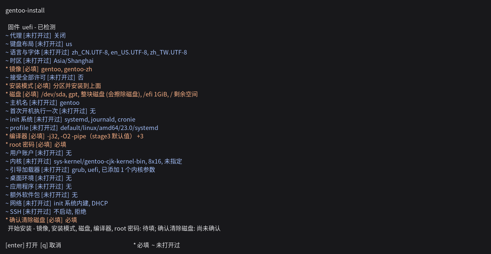

[English](README.md) | [正體中文](README.zh-TW.md) | 简体中文 | [日本語](README.ja.md) | [한국어](README.ko.md)

# gentoo-install

<!-- fact: identity -->

gentoo-install 在 Linux live 环境中运行，用于安装 amd64 架构的 Gentoo 系统。安装内容由交互式菜单或 TOML 配置文件指定。程序界面提供英文、繁体中文、简体中文、日文和韩文。




## 功能

<!-- fact: capability-scope -->

除非验证状态另行说明更窄的范围，以下路径均已实现，并有自动化单元测试或 plan 测试。

<!-- fact: storage-device-graph -->

**存储设备** 设备图涵盖 GPT 和 MBR 分区表、ext2、ext3、ext4、xfs、f2fs、vfat、包含 subvolume 的 btrfs、swap、LUKS2 加密、LVM 和 mdraid。现有分区表可以保留，每个分区可以分别指定保留、格式化或删除操作。

<!-- fact: zram-system -->

系统配置可以在设备图和 swap 分区之外单独配置 zram。

<!-- fact: in-place-conversion -->

**就地转换。**在 `[disk]` 表设置 `mode = "in-place"` 时，安装程序替换正在运行的发行版的用户空间，而不是分区磁盘。布局由机器读出，因此该表不带设备列表。`/bin`、`/sbin`、`/etc`、`/lib`、`/lib64`、`/usr` 和 `/var` 会被替换；`/home`、`/root`、`/srv`、`/opt` 和其余所有路径保持原样，且 `/etc` 是替换而非合并。

暂存的系统构建在 `/gentoo-install.new`，正在运行的系统在此期间不受影响；随后以 `rename(2)` 逐个目录交换，只有写入 esp 或引导扇区的操作排在交换之后。根位于 LUKS、LVM 或 mdraid 之下、根文件系统为安装程序无法描述的类型、根文件系统可用空间低于 10 GiB，以及在 live 介质上执行，这四种情况都会在写入任何数据之前逐项指名并拒绝。

<!-- fact: boot-system -->

**引导与系统** 引导程序可选择 GRUB 或 systemd-boot，其中 GRUB 支持 UEFI 和 BIOS，systemd-boot 支持 UEFI。还可配置 systemd 或 OpenRC、dracut、locale、键盘布局、时区、主机名、DNS、静态地址和所选的网络管理程序。

<!-- fact: desktop-language -->

**桌面与语言支持** 桌面可以选择 GNOME、KDE Plasma 和 Xfce，并搭配 GDM、SDDM 或 LightDM。图形设置涵盖 AMD、Intel、NVIDIA 和虚拟机。软件包目录包含 Fcitx 5、Rime、Anthy、Mozc、Hangul 和 CJK 字体。内核选项包括 `sys-kernel/gentoo-cjk-kernel-bin` 和 `sys-kernel/gentoo-cjk-kernel`，两者都包含 cjktty 补丁。

<!-- fact: portage -->

**Portage** 配置项包括 profile、`MAKEOPTS`、`USE`、`ACCEPT_KEYWORDS`、`L10N`、镜像和仓库同步方式。gentoo-zh 和 gig overlay 可以分别选择。界面语言选择 `zh-TW`、`zh-CN`、`ja` 或 `ko` 时，也会选择 gentoo-zh 的补丁二进制内核及其 overlay；选择 `en` 时不会自动选择。官方与 gentoo-zh 的二进制软件包来源分别使用独立的设置和密钥。

<!-- fact: proxy -->

**会话代理** `[proxy]` 配置表接受 `kind`、`host`、`port`、可选的 `username` 和 `password`，以及 `bypass`。`kind` 可以是 `http`、`https` 或 `socks5`；`host` 留空表示直接连接，这是默认值。SOCKS5 派生为 `socks5h://`，所以由代理解析主机名以访问内网。界面主菜单为每个值提供字段，并使用菜单选择代理类型。`bypass` 在界面中是逗号分隔的值，在 TOML 中是列表。

选择代理后，配置的代理用于 stage3 及其签名密钥、主仓库与 overlay 版本查询，以及 `gitweb.gentoo.org` 的 ZFS ebuild 查询。它也用于通过 `make.conf` 和 `FETCHCOMMAND`/`RESUMECOMMAND` 的 Portage 下载、`wget`、`curl`、`git`、GnuPG、binhost、overlay 及 paste 上传。时钟、初始连接检查和菜单前的镜像检查都在获得配置前执行，因此不在此设置覆盖范围内。安装程序会将认证信息排除在 dry-run 描述和发布的配置之外；发布的配置与已安装系统都只保留不含认证信息的端点和绕过列表。

<!-- fact: memory-environment -->

**内存环境。** `--ram` 与 `--lowram` 武装一次开机进入常驻内存的活环境，接着询问是否重新启动；这条路没有界面，因为它针对的机器通常只有一条 SSH 连接而没有控制台。`--ram` 用 Gentoo CJK ISO，带有 ZFS，需要约 2 GiB 内存：它的 initramfs 在内存减去 824 MiB 的活镜像后低于 1 GiB 时停在急救 shell。`--lowram` 用 Alpine netboot 套件，较小且没有 `zfs.ko`。两者都不写死版本：发布方各自列出当前的镜像与校验和，武装之前先抓取并验证。

默认启动项一律不改，所以环境没有起来时机器仍然开得了机。`--bypass` 改为替换它，用于会丢弃一次性启动项的固件；这是唯一一条环境没起来就完全开不了机的路径，没有任何路径会自动选它。

<!-- fact: memory-environment-access -->

**用 SSH 观察内存安装。** `--ssh-key` 接受公钥本文、路径、`http` 或 `https` 网址，以及 `github:user` 与 `gitlab:user`；`--ssh-port` 与 `--root-password` 设定其余部分。安装器、选定的配置与密钥都放在 initramfs 内，所以环境运行的是写出该配置的修订，而且在第一次登录之前 `authorized_keys` 已经就位。操作者以 SSH 重新连接观察安装，不必一直开着控制台。回答第一个画面之前不会清除任何数据：该画面提供安装与急救 shell 两项，而且没有超时。

<!-- fact: plan-records -->

**计划与记录** dry run 会在不探测存储硬件的情况下显示操作计划。实际安装使用相同的规划器，但会先加入从复用设备探测到的 mdraid 元数据，因此依赖硬件的验证结果可能不同。`install.log` 记录命令输出，`install.jsonl` 记录操作、软件包来源和二进制软件包降级原因。菜单将配置上传至 `paste.gentoozh.org` 前，会把 `password_hash` 和 `root_password_hash` 的值替换为 `removed-before-publishing`，并且完全不写出代理的 `username` 和 `password` 这两个键；其他配置值仍会上传。菜单会以文本和 QR 码显示上传页面的网址。

## 验证状态

<!-- fact: verification-scope -->

[`TESTED.md`](TESTED.md) 是验证记录：每一条走过的路径各一行，写明它运行时的安装器修订版与运行的地点。一次运行要记录的修订版与安装器相符、安装退出码为 `0`、装出的系统能引导、且引导后的配置检查全部通过，才算数。

装到磁盘上的路径在集群与单机都有记录，覆盖 ext4、xfs、btrfs、f2fs、ZFS、LVM、mdraid 与 LUKS2，两种固件与两种 init 系统皆有。就地转换运行中的系统已有四条 QEMU 记录：两条 BIOS，一条保留 `/home` 的 UEFI，以及一条根文件系统为 btrfs、`/home` 与 `/var` 是 subvolume 的 UEFI。

`--ram` 和 `--lowram` 各有 QEMU 记录：一台 Debian 12 机器武装一次启动、默认启动项未变、重新启动后进入送达的环境——`--ram` 是 Gentoo CJK ISO，`--lowram` 是 Alpine netboot 压缩包——并带着交付给它的配置。在两种环境里回答 `install` 各有一条记录：机器装出 Gentoo、启动它写出的磁盘，并通过共用的安装后检查。另一台机器的武装项被移除 initramfs，在协调器换客机的电源循环之后，接下来两次启动都进入原本的云系统。`dd` 有一条记录：从活介质把准备好的镜像写入整块磁盘并逐字节读回，原始和 gzip 两种格式皆是。

静态地址、ext2 和 ext3 各自有集群记录。源代码构建的内核和 binhost 降级只有 runner 层级的测试，而 runner 层级的测试不是端到端记录。

`tests/fixtures/` 下的文件验证的是配置模型，它们存在并不代表任何一台装出来的机器。

## 要求

<!-- fact: requirements-runtime -->

实际安装需要 root 权限、amd64 架构和 Python 3.11 或更高版本。使用配置文件执行 dry run 不需要 root 权限。安装程序没有第三方 Python 运行时依赖项。

<!-- fact: requirements-version-sources -->

菜单从 `packages.gentoo.org` 读取 Gentoo 主仓库的软件包版本，并从 `api.github.com/repos/gentoo-zh/overlay/contents` 读取 gentoo-zh 补丁内核版本。`sys-fs/zfs` 接受的最高内核版本从 `gitweb.gentoo.org` 读取。使用配置文件安装时需要连接的是该配置指定的镜像；`--missing-commands` 和 `--config FILE --dry-run` 都不需要这些版本端点。

<!-- fact: requirements-network-filter -->

live 环境有 IPv6 但没有 IPv4 时，菜单会停用记录中标为仅可通过 IPv4 访问的 Gentoo 镜像。

<!-- fact: requirements-bootstrap -->

`bootstrap.sh` 会读取 `/etc/os-release`、报告缺少的命令，并显示候选的软件包管理器命令。它可识别以下发行版系列：Debian 和 Ubuntu、Arch、openSUSE、Fedora、RHEL 和 CentOS、Gentoo、Alpine。显示的命令必须在执行前核对。

## 安全事项

<!-- fact: safety-destructive -->

实际安装会写入所选磁盘。使用配置文件运行时不会再次要求确认擦除磁盘；`wipe = true`、删除分区和创建文件系统都可能破坏现有数据。

<!-- fact: safety-review-backup -->

实际安装前，必须在 dry-run 输出中核对磁盘选择器和每项破坏性操作。稳定的 `/dev/disk/by-id/` 选择器优于 `/dev/sda` 之类的名称；需要保留的数据必须另有一份独立于所选磁盘的备份。

## 安装

<!-- fact: install-download -->

以下命令下载当前的 `master` 归档文件并打开菜单：

```sh
curl -fsSL https://github.com/Zakkaus/gentoo-install/archive/refs/heads/master.tar.gz | tar xz
cd gentoo-install-master
./bootstrap.sh
```

<!-- fact: install-terminal -->

菜单需要至少 80 列、24 行的交互式终端。安装程序启动时会询问一次界面语言；`--lang zh-CN` 直接选择简体中文。

<!-- fact: install-config-workflow -->

菜单可将配置保存为 `my-install.toml` 后退出。以下流程会先显示完整的配置计划，再执行实际安装：

```sh
./bootstrap.sh --config my-install.toml --dry-run
# 接着择一执行下列其中一行。两者都会写入所选磁盘。
./bootstrap.sh --config my-install.toml
./bootstrap.sh --config my-install.toml --no-shell   # 同一次安装，不询问是否打开 root shell
```

<!-- fact: install-root-shell -->

交互式安装无论成功或失败，都会在卸载前提供在目标系统内打开 root shell 的选项。`--no-shell` 跳过这项确认。

## 从中断处继续

<!-- fact: resume-behavior -->

`--resume` 只会跳过位置和标识均与当前计划匹配，且效果标记为重新启动后仍然存在的已完成操作：

```sh
./bootstrap.sh --config my-install.toml --resume
```

<!-- fact: resume-limits -->

继续执行仅限同一个 live 会话、同一个安装程序修订版与同一份配置文件。默认日志位于 `/run/gentoo-install/install.jsonl`，重新启动后不会保留。每条操作记录都包含根据该操作类源代码和字段值生成的标识；标识变化的操作会重新执行而不是跳过。共用辅助函数或常量的更改不在该标识覆盖范围内，日志也不记录整份配置的摘要，因此不同修订版或配置文件不在续装的文档约定范围内。

## 配置文件

<!-- fact: config-model -->

配置文件使用 TOML。顶层 `config_version` 字段指定结构版本。存储设备以设备图表示：每个设备都有 `id`，设备通过其他设备的 `id` 建立引用，选择器仅在实际安装时解析。

<!-- fact: config-fixtures -->

[`tests/fixtures/vm-binpkg.toml`](tests/fixtures/vm-binpkg.toml) 是完整的 UEFI 和 ext4 结构参考。其他 [`tests/fixtures/`](tests/fixtures/) 文件覆盖 BIOS、LUKS2、LVM、mdraid、ZFS、btrfs subvolume 和桌面。这些文件使用虚拟机磁盘选择器和测试密码，不得原样用于实际机器的安装。

<!-- fact: config-dry-run -->

解析与计划阶段不会探测存储硬件，因此没有目标磁盘的机器也能通过 `--dry-run` 检查配置。

以下完整配置演示包含认证信息和两个绕过主机。认证信息只是示例，执行前必须替换：

```toml
config_version = 1

[proxy]
kind = "socks5"
host = "proxy.example"
port = 1080
username = "operator"
password = "secret"
bypass = ["localhost", "intranet.example"]

[system]
hostname = "proxy-target"
timezone = "UTC"
locales = ["en_US.UTF-8"]
locale = "en_US.UTF-8"
init = "openrc"
root_password_hash = "$6$gentooinst$IR3GrdJ862XljQYDqocr4tKniIRDIT.jQNFzIrHE3U75H6B6YSWZoSYoVd5edSHpqaYBdiNfXHCoIPRVgb9lT/"

[portage]
profile = "default/linux/amd64/23.0"
makeopts = "-j4"

[portage.binhost]
official = false

[bootloader]
firmware = "bios"

[disk]
root = "mnt-root"

[[disk.devices]]
kind = "existing"
id = "disk"
selector = "/dev/disk/by-id/virtio-target0"
wipe = true

[[disk.devices]]
kind = "table"
id = "table"
disk = "disk"
table = "mbr"

[[disk.devices]]
kind = "partition"
id = "rootpart"
table = "table"
index = 1
role = "data"

[[disk.devices]]
kind = "filesystem"
id = "rootfs"
device = "rootpart"
type = "ext4"

[[disk.devices]]
kind = "mountpoint"
id = "mnt-root"
source = "rootfs"
path = "/"
```

## 二进制软件包

<!-- fact: binary-packages -->

二进制软件包属于可选功能。关闭后仍可从源代码构建。官方 binhost 和 gentoo-zh binhost 是两个独立选项，并使用不同的信任配置。目前没有端到端证据覆盖 binhost 无法连接、缺少签名或密钥不受信任的情况；这些降级路径仍未验证。

## 退出码

<!-- fact: exit-codes -->

对于 `gentoo-install`，`0` 表示成功完成，`1` 表示配置错误。`2` 表示 `argparse` 用法错误或 preflight 失败，`3` 表示完整性验证失败。`4` 表示下载、外部命令、操作系统或未分类的安装程序失败，`5` 表示操作者中止。Python CLI 启动前，如果 Python、必要命令或 root 权限检查失败，`bootstrap.sh` 也可能以 `1` 退出。

## 常见问题

<!-- fact: faq-customisation -->

**这种安装器会不会让 Gentoo 失去可定制性？**

不会。它只做基础安装就停手：分区、stage3、Portage 配置、内核、bootloader，以及可选的桌面。之后的每个决定仍然属于操作者，而那台机器是一套普通的 Gentoo，上面不留本项目的任何组件。它省掉的是第一个小时的成本，而那正是 Gentoo 难以入门、也难以在大量机器或 VPS 上部署的原因。

## 参与开发

<!-- fact: contributing -->

[CONTRIBUTING.md](CONTRIBUTING.md) 介绍开发环境、架构和必要检查。

## 许可

<!-- fact: license -->

本项目以 GNU General Public License 发布，版本为第 2 版，或由接收者选择任何更新的版本。第 2 版全文见 [LICENSE](LICENSE)，每份源代码文件带有 `SPDX-License-Identifier: GPL-2.0-or-later`。
