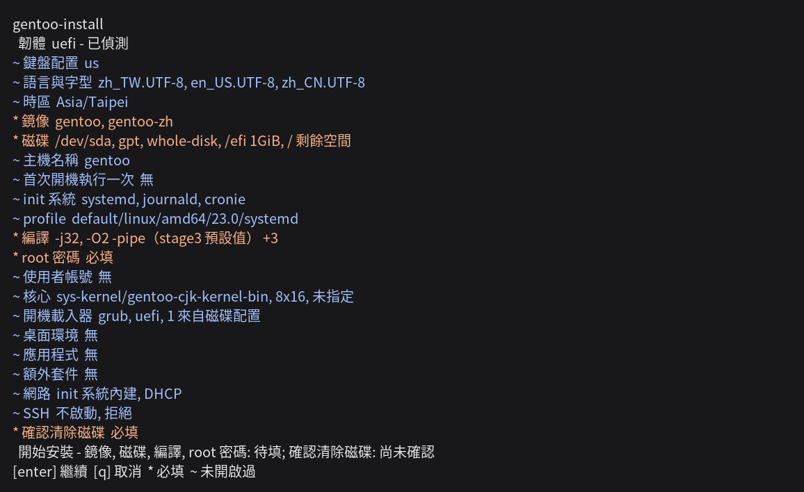

[English](README.md) | 正體中文 | [简体中文](README.zh-CN.md) | [日本語](README.ja.md) | [한국어](README.ko.md)

# gentoo-install

<!-- fact: identity -->

gentoo-install 在 Linux live 環境中執行，用於安裝 amd64 架構的 Gentoo 系統。安裝內容以互動式選單或 TOML 設定檔指定。介面提供英文、正體中文、簡體中文、日文與韓文。




## 需求

<!-- fact: requirements-runtime -->

實際安裝需要 root 權限、amd64 目標與 Python 3.11 以上版本。使用設定檔執行 dry run 不需要 root 權限。安裝器沒有第三方 Python 執行期相依套件。

<!-- fact: requirements-version-sources -->

選單從 `packages.gentoo.org` 讀取 Gentoo 主儲存庫的套件版本，並從 `api.github.com/repos/gentoo-zh/overlay/contents` 讀取 gentoo-zh 修補核心的版本。`sys-fs/zfs` 接受的最高核心版本從 `gitweb.gentoo.org` 讀取。以設定檔安裝時需要連線的是該設定指定的鏡像；`--missing-commands` 與 `--config FILE --dry-run` 都不需要這些版本端點。

<!-- fact: requirements-network-filter -->

live 環境有 IPv6 但沒有 IPv4 時，選單會停用記錄中標為僅能透過 IPv4 存取的 Gentoo 鏡像。

<!-- fact: requirements-bootstrap -->

`bootstrap.sh` 會讀取 `/etc/os-release`、回報缺少的指令，並印出候選的套件管理器指令。它可辨識下列發行版系列：Debian 與 Ubuntu、Arch、openSUSE、Fedora、RHEL 與 CentOS、Gentoo、Alpine。印出的指令必須在執行前核對。

## 安全事項

<!-- fact: safety-destructive -->

實際安裝會寫入所選磁碟。使用設定檔執行時不會再次要求確認清除磁碟；`wipe = true`、刪除分割區與建立檔案系統都可能毀損既有資料。

<!-- fact: safety-review-backup -->

實際安裝前，必須在 dry-run 輸出中核對磁碟選擇器與每項破壞性操作。穩定的 `/dev/disk/by-id/` 選擇器優於 `/dev/sda` 之類的名稱；需要保留的資料必須另有備份。

## 安裝

<!-- fact: install-download -->

下列指令會下載目前的 `master` 封存檔並開啟選單：

```sh
curl -fsSL https://github.com/Zakkaus/gentoo-install/archive/refs/heads/master.tar.gz | tar xz
cd gentoo-install-master
./bootstrap.sh
```

<!-- fact: install-terminal -->

選單需要至少 80 欄、24 列的互動式終端機。安裝器啟動時會詢問一次介面語言；`--lang zh-TW` 可直接選用正體中文。

<!-- fact: install-config-workflow -->

選單可將答案儲存為 `my-install.toml` 後離開。下列流程會先印出完整計畫，再執行實際安裝：

```sh
./bootstrap.sh --config my-install.toml --dry-run
# 接著擇一執行下列其中一行。兩者都會寫入所選磁碟。
./bootstrap.sh --config my-install.toml
./bootstrap.sh --config my-install.toml --no-shell   # 同一次安裝，不詢問是否開啟 root shell
```

<!-- fact: install-root-shell -->

互動式安裝無論成功或失敗，都會在卸載前提供於目標系統內開啟 root shell 的選項。`--no-shell` 可略過這項確認。

## 從記憶體安裝

<!-- fact: install-memory -->

`--ram` 與 `--lowram` 武裝一次進入記憶體中活環境的開機，那是一台沒有主控台、也沒有救援映像的租用機器覆蓋自己磁碟之前所需要的。安裝器、選定的設定與授權金鑰都隨 initramfs 送達，因此環境起來時執行的正是武裝它的那一版：

```sh
./bootstrap.sh --ram --ssh-key github:zakkaus --root-password 'replace this'
reboot
ssh root@the-machine
```

預設開機項目不會更動，所以沒有進入該環境的機器仍開回原本的系統；`--disarm` 收回武裝。`--bypass` 改為取代預設項目，供會丟棄一次性項目的韌體使用，那也是唯一一條「環境起不來就連機器都開不起來」的路徑。

第一個畫面提供安裝與救援 shell，沒有逾時，未回答之前不會抹除任何資料。`--ram` 開的是帶 ZFS 的 Gentoo CJK ISO，約需 2 GiB 記憶體；`--lowram` 開的是較小、沒有 `zfs.ko` 的 Alpine netboot 壓縮檔。`--ssh-port` 把服務移離 22 埠。

## 轉換執行中的系統

<!-- fact: install-in-place -->

在 `[disk]` 表設 `mode = "in-place"`，安裝器取代執行中發行版的使用者空間，而不是分割磁碟。該表不帶裝置清單，因為版面由機器讀出：

```toml
config_version = 1

[system]
hostname = "converted"
timezone = "UTC"
locales = ["en_US.UTF-8"]
locale = "en_US.UTF-8"
init = "systemd"
root_password_hash = "$6$gentooinst$IR3GrdJ862XljQYDqocr4tKniIRDIT.jQNFzIrHE3U75H6B6YSWZoSYoVd5edSHpqaYBdiNfXHCoIPRVgb9lT/"

[portage]
profile = "default/linux/amd64/23.0/systemd"
makeopts = "-j4"

[bootloader]
kind = "grub"
firmware = "uefi"

[disk]
mode = "in-place"
```

上面那個雜湊是範例，執行前必須替換。互動式執行會印出這次轉換取代哪些目錄，並要求輸入 `convert` 才會寫入任何資料；沒有終端機的執行不會被詢問，因為設定檔裡的 `mode = "in-place"` 就是授權，而在那裡發問會讓序列主控台永遠等下去。

**發起這次執行的工作階段必須保持連線。**`/usr` 與 `/etc` 換成新系統之後，新的 SSH 登入不再成立，而發起執行的工作階段仍持有它已經映射的執行檔。

## 從中斷處繼續

<!-- fact: resume-behavior -->

`--resume` 只會略過位置與識別碼均符合現行計畫，且效果標記為重新開機後仍然存在的已完成操作：

```sh
./bootstrap.sh --config my-install.toml --resume
```

<!-- fact: resume-limits -->

繼續執行僅限同一個 live 工作階段、同一個安裝器與同一份設定檔，而且安裝器會拒絕其他情況，不再只是寫在文件裡。

- 日誌開頭記錄設定的摘要、機器的 boot id 與安裝器原始碼的摘要；`--resume` 三者都比對，任何一項不同就停下並說明原因。核心不提供 boot id 的機器只比對其餘兩項。
- 預設日誌位於 `/run/gentoo-install/install.jsonl`，本來就不會在重新開機後保留。
- 每筆操作記錄另外包含根據該操作類別原始碼與欄位值產生的識別碼，識別碼改變的操作會重新執行而不是略過。共用輔助函式或常數的變更不在該識別碼範圍內，改由安裝器摘要涵蓋。

## 功能

<!-- fact: capability-scope -->

除非驗證狀態另行指出較窄的範圍，以下路徑均已實作，並有自動化單元測試或 plan 測試。

<!-- fact: storage-device-graph -->

**儲存裝置**
- 裝置圖涵蓋 GPT 與 MBR 分割表、ext2、ext3、ext4、xfs、f2fs、vfat、含 subvolume 的 btrfs、swap、LUKS2 加密、LVM 與 mdraid。
- ZFS 屬於同一張裝置圖：pool 在其 vdev 之上採 stripe、mirror 或 raidz1、raidz2、raidz3，原生加密是 pool 的屬性，每個 dataset 各為一個節點。
- 既有分割表可以保留，每個分割區可分別指定保留、格式化或刪除。

<!-- fact: zram-system -->

系統設定可在裝置圖與 swap 分割區之外，獨立設定 zram。

<!-- fact: in-place-conversion -->

**就地轉換。**
- 在 `[disk]` 表設定 `mode = "in-place"` 時，安裝器取代執行中發行版的使用者空間，而不是分割磁碟。
- 版面由機器讀出，因此該表不帶裝置清單。
- `/bin`、`/sbin`、`/etc`、`/lib`、`/lib64`、`/usr` 與 `/var` 會被取代；`/home`、`/root`、`/srv`、`/opt` 與其餘所有路徑維持原狀，且 `/etc` 是取代而非合併。

- 暫存的系統建置在 `/gentoo-install.new`，執行中的系統在此期間不受影響；隨後以 `rename(2)` 逐個目錄交換，只有寫入 esp 或開機磁區的操作排在交換之後。
- 根位於 LUKS、LVM 或 mdraid 之下、根檔案系統為安裝器無法描述的類型、根檔案系統可用空間低於 10 GiB，以及在 live 媒介上執行，這四種情況都會在寫入任何資料之前逐項指名並拒絕。

<!-- fact: prepared-image -->

**磁碟映像**
- `mode = "image"` 把系統裝進 `disk.image` 指定、`disk.size` 決定大小的稀疏檔案，而不是裝到磁碟上，產物因此是一份可以複製到別處、之後再寫入的檔案。
- `mode = "dd"` 不執行安裝：它把 `disk.source` 的映像串流寫到 `disk.destination` 這顆整顆磁碟，讀取時解開 `raw`、`gz`、`xz`、`zst` 或 `tar`，並保留該映像原本帶的版面與開機載入器。
- 兩種模式互不接受對方的鍵，`partition` 模式兩組都不接受。

<!-- fact: boot-system -->

**開機與系統**
- 開機載入器可選 GRUB、systemd-boot 或 ZFSBootMenu。GRUB 支援 UEFI 與 BIOS，systemd-boot 支援 UEFI。
- ZFSBootMenu 在 UEFI 上開機 ZFS 根，核心取自 pool 內開機環境自己的 `/boot`。安裝器另可設定 systemd 或 OpenRC、dracut、locale、鍵盤配置、時區、主機名稱、DNS、靜態位址與所選的網路管理程式。

<!-- fact: remote-unlock -->

**以 ssh 解開加密的根**
- `[kernel.remote_unlock]` 在開機路徑放進一個 ssh 服務，供無人在旁邊回答密語提示的機器使用。
- `enabled` 開啟這條路徑；`port` 預設 222 而不是 22，避免用戶端對執行中系統的 `known_hosts` 記錄與 initramfs 的那筆相撞；`address`、`gateway` 與 `interface` 給該服務一個靜態位址，位址留空則改用 DHCP。
- LUKS 根由系統 initramfs 裡的 `sys-kernel/dracut-crypt-ssh` 開啟，ZFS 根則由 ZFSBootMenu 建進自己映像的 dropbear 開啟。
- 授權金鑰取自 `system.authorized_keys`：開了這條路徑又沒有列出任何金鑰的設定會被逐項指名並拒絕，因為那描述的是一個沒有人登入得進去的服務。

<!-- fact: desktop-language -->

**桌面與語言支援**
- 桌面可選 GNOME、KDE Plasma 與 Xfce，並搭配 gdm、sddm、lightdm，或 greetd 與它的 tuigreet 主控台登入畫面。
- 圖形設定涵蓋 AMD、Intel、NVIDIA 與虛擬機。
- 套件目錄包含 fcitx5、Rime、Anthy、Mozc、Hangul 與 CJK 字型。
- 核心選項包括 `sys-kernel/gentoo-cjk-kernel-bin` 與 `sys-kernel/gentoo-cjk-kernel`，兩者都包含 cjktty 修補程式。

<!-- fact: portage -->

**Portage**
- 設定項目包含 profile、`MAKEOPTS`、`USE`、`ACCEPT_KEYWORDS`、`L10N`、鏡像與儲存庫同步方式。
- gentoo-zh 與 gig overlay 可分別選取。
- 介面語言選為 `zh-TW`、`zh-CN`、`ja` 或 `ko` 時，也會選取 gentoo-zh 的修補版二進位核心及其 overlay；選為 `en` 時不會自動選取。
- 官方與 gentoo-zh 的二進位套件來源各有獨立設定與金鑰。

<!-- fact: proxy -->

**工作階段 Proxy**
- `[proxy]` 設定表接受 `kind`、`host`、`port`、可選的 `username` 與 `password`，以及 `bypass`。
- `kind` 可以是 `http`、`https` 或 `socks5`；`host` 留白表示直接連線，這是預設值。
- SOCKS5 會導出為 `socks5h://`，所以由 Proxy 解析主機名稱以存取內網。
- 介面主選單為每個值提供欄位，並以選單選擇 Proxy 類型。
- `bypass` 在介面中是逗號分隔的值，在 TOML 中是清單。

- 選取 Proxy 後，設定的 Proxy 用於 stage3 與其簽署金鑰、主儲存庫與 overlay 版本查詢，以及 `gitweb.gentoo.org` 的 ZFS ebuild 查詢。
- 它也用於透過 `make.conf` 與 `FETCHCOMMAND`/`RESUMECOMMAND` 的 Portage 下載、`wget`、`curl`、`git`、GnuPG、binhost、overlay 與 paste 上傳。
- 時鐘、初始連線檢查與選單前的鏡像檢查都在取得設定前執行，因此不在此設定涵蓋範圍內。安裝器會將認證資訊排除在 dry-run 說明與發佈的設定之外；發佈的設定與已安裝系統都只保留不含認證資訊的端點及略過清單。

<!-- fact: memory-environment -->

**記憶體環境。**
- `--ram` 與 `--lowram` 武裝一次開機進入常駐記憶體的活環境，接著詢問是否重新開機；這條路沒有介面，因為它針對的機器通常只有一條 SSH 連線而沒有主控台。
- `--ram` 用 Gentoo CJK ISO，帶有 ZFS，需要約 2 GiB 記憶體：它的 initramfs 在記憶體扣掉 824 MiB 的活映像後低於 1 GiB 時停在急救殼。
- `--lowram` 用 Alpine netboot 套組，較小且沒有 `zfs.ko`。
- 兩者都不寫死版本：發佈方各自列出目前的映像與校驗和，武裝之前先抓取並驗證。

- 預設開機項目一律不改，所以環境沒有起來時機器仍然開得了機。
- `--bypass` 改為替換它，用於會丟棄一次性項目的韌體；這是唯一一條環境沒起來就完全開不了機的路徑，沒有任何路徑會自動選它。

<!-- fact: memory-environment-access -->

**用 SSH 觀察記憶體安裝。**
- `--ssh-key` 接受公鑰本文（`ssh-ed25519`、`ssh-rsa`、`ecdsa-sha2-nistp256`、`-384`、`-521` 以及 `sk-` 變體）、路徑、`http` 或 `https` 網址，以及 `github:user` 與 `gitlab:user`；`--ssh-port` 與 `--root-password` 設定其餘部分。
- 安裝器、選定的設定與金鑰都放在 initramfs 內，所以環境執行的是寫出該設定的修訂，而且在第一次登入之前 `authorized_keys` 已經就位。
- 操作者以 SSH 重新連線觀察安裝，不必一直開著主控台。
- 回答第一個畫面之前不會清除任何資料：該畫面提供安裝與急救殼兩項，而且沒有逾時。

<!-- fact: plan-records -->

**計畫與記錄**
- dry run 會在不探測儲存硬體的情況下顯示操作計畫。
- 實際安裝使用相同的規劃器，但會先加入從重用裝置探測到的 mdraid 中繼資料，因此依賴硬體的驗證結果可能不同。
- `install.log` 記錄指令輸出，`install.jsonl` 記錄操作、套件來源與二進位套件降級原因。
- 選單將設定上傳至 `paste.gentoozh.org` 前，會把 `password_hash` 與 `root_password_hash` 的值替換為 `removed-before-publishing`，並且完全不寫出代理的 `username` 與 `password` 這兩個鍵；其他設定值仍會上傳。
- 選單會以文字與 QR 碼顯示上傳頁面的網址。

## 驗證狀態

<!-- fact: verification-scope -->

[`TESTED.md`](TESTED.md) 是驗證記錄：每一條走過的路徑各一列，寫明它執行時的安裝器修訂版與執行的地點。一次執行要記錄的修訂版與安裝器相符、安裝退出碼為 `0`、裝出的系統能開機、且開機後的設定檢查全部通過，才算數。

| 路徑 | 記錄 |
| --- | --- |
| 裝到磁碟上 | ext4、ext2、ext3、xfs、btrfs、f2fs、ZFS、LVM、mdraid 與 LUKS2，兩種韌體與兩種 init 系統皆有 |
| ZFS pool | stripe、mirror、raidz、加密 pool，以及一個由 ZFSBootMenu 開機的 pool |
| 以 ssh 解鎖 | 由系統 initramfs 開啟的 LUKS 根，以及由 ZFSBootMenu 自己映像開啟的 ZFS pool |
| 靜態位址與 greetd | 各自有叢集記錄 |
| 就地轉換執行中的系統 | 四筆 QEMU 記錄：兩筆 BIOS，一筆保留 `/home` 的 UEFI，一筆根檔案系統是 btrfs、`/home` 與 `/var` 為 subvolume 的 UEFI |
| 轉換這個安裝器裝出來的機器 | 六次走到重新開機的叢集轉換裡，五次開得起來，一次因為缺少模組停在 GRUB 的救援殼層，而轉換本身的退出碼是 `0`，所以這條路徑還不可靠 |
| `--ram` 與 `--lowram` | 一台 Debian 12 機器武裝一次開機、預設開機項目未變，重新開機後帶著交付給它的設定進入送達的環境；在那裡回答 `install` 會裝出 Gentoo 並開起它寫出的磁碟 |
| `--bypass` | 一台被移除武裝項目 initramfs 的機器，在接續的兩次開機都進入原本的雲系統 |
| `dd` | 一筆記錄：從 live 媒介把準備好的映像寫入整顆磁碟並逐位元組讀回，原始與 gzip 兩種格式皆是 |
| 裝進檔案 | 一筆記錄：映像以 `losetup -Pf` 掛上，讀回的是它版面宣告的那兩個檔案系統，而沒有任何機器從那份檔案開機過 |
| 選單 | 在 80x24 的序列主控台上逐列開過，涵蓋英文、正體中文、簡體中文、日文與韓文，沒有一列寬過終端機 |

原始碼建置的核心與二進位套件降級只有 runner 層級的測試，而 runner 層級的測試不是端到端記錄。`tests/fixtures/` 底下的檔案驗證的是設定模型，它們存在並不代表任何一台裝出來的機器。

## 設定檔

<!-- fact: config-model -->

設定檔使用 TOML。頂層的 `config_version` 欄位指定結構版本。儲存裝置以裝置圖表示：每個裝置都有 `id`，裝置以其他裝置的 `id` 建立引用，選擇器只在實際安裝時解析。

<!-- fact: config-fixtures -->

[`tests/fixtures/vm-binpkg.toml`](tests/fixtures/vm-binpkg.toml) 是完整的 UEFI 與 ext4 結構參考。其他 [`tests/fixtures/`](tests/fixtures/) 檔案涵蓋 BIOS、LUKS2、LVM、mdraid、ZFS、btrfs subvolume 與桌面。這些檔案使用虛擬機磁碟選擇器與測試密碼，不得原樣用於實機安裝。

<!-- fact: config-dry-run -->

解析與計畫階段不會探測儲存硬體，因此沒有目標磁碟的機器也能以 `--dry-run` 檢查設定。

以下完整設定示範包含認證資訊與兩個略過主機的 Proxy。認證資訊只是範例，執行前必須替換：

```toml
config_version = 1

[proxy]
kind = "socks5"
host = "proxy.example"
port = 1080
username = "operator"
password = "secret"
bypass = ["localhost", "intranet.example"]

[system]
hostname = "proxy-target"
timezone = "UTC"
locales = ["en_US.UTF-8"]
locale = "en_US.UTF-8"
init = "openrc"
root_password_hash = "$6$gentooinst$IR3GrdJ862XljQYDqocr4tKniIRDIT.jQNFzIrHE3U75H6B6YSWZoSYoVd5edSHpqaYBdiNfXHCoIPRVgb9lT/"

[portage]
profile = "default/linux/amd64/23.0"
makeopts = "-j4"

[portage.binhost]
official = false

[bootloader]
firmware = "bios"

[disk]
root = "mnt-root"

[[disk.devices]]
kind = "existing"
id = "disk"
selector = "/dev/disk/by-id/virtio-target0"
wipe = true

[[disk.devices]]
kind = "table"
id = "table"
disk = "disk"
table = "mbr"

[[disk.devices]]
kind = "partition"
id = "rootpart"
table = "table"
index = 1
role = "data"

[[disk.devices]]
kind = "filesystem"
id = "rootfs"
device = "rootpart"
type = "ext4"

[[disk.devices]]
kind = "mountpoint"
id = "mnt-root"
source = "rootfs"
path = "/"
```

## 二進位套件

<!-- fact: binary-packages -->

二進位套件為選用功能。關閉後仍可從原始碼建置。官方 binhost 與 gentoo-zh binhost 是兩個獨立選項，並使用不同的信任設定。目前沒有端到端實據涵蓋 binhost 無法連線、缺少簽章或金鑰不受信任的情況；這些降級路徑仍未驗證。

## 退出碼

<!-- fact: exit-codes -->

| 退出碼 | `gentoo-install` |
| --- | --- |
| `0` | 成功完成 |
| `1` | 設定錯誤 |
| `2` | `argparse` 用法錯誤或 preflight 失敗 |
| `3` | 完整性驗證失敗 |
| `4` | 下載、外部指令、作業系統或未分類的安裝器失敗 |
| `5` | 操作者中止 |

Python CLI 啟動前，如果 Python、必要指令或 root 權限檢查失敗，`bootstrap.sh` 也可能以 `1` 退出。

## 常見問題

<!-- fact: faq-customisation -->

**這種安裝器會不會讓 Gentoo 失去可自訂性？**

不會。它只執行基礎安裝：分割區、stage3、Portage 設定、核心、bootloader，以及選用的桌面。之後的每個決定仍然屬於操作者，而那台機器是一套普通的 Gentoo，上面不留本專案的任何元件。它省掉的是第一個小時的成本，而那正是 Gentoo 難以入門、也難以在大量機器或 VPS 上部署的原因。

## 參與開發

<!-- fact: contributing -->

[CONTRIBUTING.md](CONTRIBUTING.md) 說明開發環境、架構與必要檢查。

## 授權

<!-- fact: license -->

本專案以 GNU General Public License 散布，版本為第 2 版，或由接收者選擇任何較新的版本。第 2 版全文見 [LICENSE](LICENSE)，每份原始碼檔案帶有 `SPDX-License-Identifier: GPL-2.0-or-later`。
